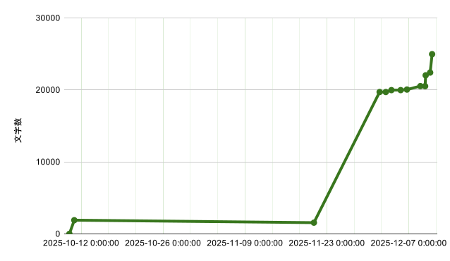

これは、[TSG Advent Calendar 2025](https://adventar.org/calendars/12405) の 11 日目の記事です。

---

計測をしてその結果を時系列に並べると楽しい。
その計測結果が進捗に紐づいていると、さらに楽しい。
進捗がないことを示す計測結果は、べつに楽しくはないが、やる気を出すきっかけになるかもしれない。

論文執筆とは、一定の文字数を打ち込むこと。
その文字数を定期的にタイムスタンプ付きで取得して、書き終わったあとに可視化して、やんややんや言いたい。全体の文字数だけじゃなくて、章ごとの文字数や見出し・キャプションの文字数も把握できれば楽しそうだ。

[`texcount`](https://ctan.org/pkg/texcount) というコマンドを使うと、TeX ファイルの文字数を詳しくカウントできる。

## texcount

`texcount` は、以下のような情報を取得できる。

- 本文の文字数
- 見出しの文字数
- キャプションの文字数
- 数式（インライン・ディスプレイ）の数
- 図表の数
- 章ごとの集計

## 基本的な使い方

TeX Live をインストールしていれば、大体の場合 `texcount` コマンドはすでに使えるようになっている。

基本的な使い方は以下の通り。

```bash
texcount -char -incbib -merge doc/template.tex
```

- `-char`: 文字数をカウント（デフォルトは単語数）
- `-incbib`: 参考文献も含める
- `-merge`: `\input` しているファイルも含めて1つのドキュメントとして扱う。必要があれば dir オプションでディレクトリを指定する。テンプレートファイルなどから分割した tex ファイルを読み込むような構成であれば、このオプションを使うとよい。

その他の詳細なオプションは、[公式ドキュメント](https://ctan.org/pkg/texcount)を参照してほしい。割とオプションの種類が多く、ignore みたいなこともできそう。

## 実行時刻を記録しながら結果を保存するスクリプト

執筆の進捗を追跡するために、実行時刻を記録しながら、詳細な結果を保存するスクリプトを作成した。
私の環境に合わせて doc/template.tex を指定しているが、ここは適宜変更してほしい。

```bash
#!/bin/bash
set -e

# YYYYMMDDHHMMSS
CURRENT_DATE=$(date +"%Y%m%d%H%M%S")
OUTPUT_DIR="count_results"
OUTPUT_FILE="${OUTPUT_DIR}/${CURRENT_DATE}.count.txt"
mkdir -p ${OUTPUT_DIR}
echo "Counting characters in .tex files..."

echo "Count Results - ${CURRENT_DATE}" > ${OUTPUT_FILE}

echo "=== Summary Count ===" >> ${OUTPUT_FILE}
texcount -merge -char -incbib -total -dir doc -sum doc/template.tex >> ${OUTPUT_FILE}

echo "=== Chapter-wise Count ===" >> ${OUTPUT_FILE}
texcount -merge -char -incbib -sub=chapter -dir doc doc/template.tex >> ${OUTPUT_FILE}

echo "=== Detailed Log ===" >> ${OUTPUT_FILE}
texcount -merge -char -incbib -dir doc -stat -macrostat doc/template.tex >> ${OUTPUT_FILE}
echo "Results saved to ${OUTPUT_FILE}"
```

たとえば、これを`count.sh`という名前で保存して、`./count.sh`と実行する。

このスクリプトは以下の処理を行う。

1. 実行時刻を `YYYYMMDDHHMMSS` 形式で取得
2. `count_results` ディレクトリに結果を保存（ファイル名に時刻を含める）
3. 3種類の集計結果を取得
   - Summary Count: 全体の集計（総文字数、見出し・キャプションの文字数など）
   - Chapter-wise Count: 章ごとの集計
   - Detailed Log: 詳細なログ（セクションごとの集計、マクロの使用状況など）

## 出力例

実行すると、以下のような結果が得られる。

```
Count Results - 20251210233911
=== Summary Count ===
Total
Sum count: 38450
Letters in text: 24970
Letters in headers: 806
Letters in captions: 12671
Number of headers: 84
Number of floats/tables/figures: 22
Number of math inlines: 3
Number of math displayed: 0
Files: 2

=== Chapter-wise Count ===
File: doc
Encoding: ascii
Letters in text: 0
Letters in headers: 0
Letters in captions: 0
Number of headers: 0
Number of floats/tables/figures: 0
Number of math inlines: 0
Number of math displayed: 0

File: doc/template.tex
Encoding: utf8
Letters in text: 24970
Letters in headers: 806
Letters in captions: 12671
Number of headers: 84
Number of floats/tables/figures: 22
Number of math inlines: 3
Number of math displayed: 0
Subcounts:
  text+headers+captions (#headers/#floats/#inlines/#displayed)
  102+0+0 (0/0/0/0) _top_
  3270+78+60 (8/4/0/0) Chapter: はじめに
... 章ごとの集計結果が続く

=== Detailed Log ===
File: doc
Encoding: ascii
Letters in text: 0
Letters in headers: 0
Letters in captions: 0
Number of headers: 0
Number of floats/tables/figures: 0
Number of math inlines: 0
Number of math displayed: 0

File: doc/template.tex
Encoding: utf8
Letters in text: 24970
Letters in headers: 806
Letters in captions: 12671
Number of headers: 84
Number of floats/tables/figures: 22
Number of math inlines: 3
Number of math displayed: 0
Subcounts:
  text+headers+captions (#headers/#floats/#inlines/#displayed)
  102+0+0 (0/0/0/0) _top_
  0+4+0 (1/0/0/0) Chapter: はじめに
... 章ごとの集計結果が続く

Word: Freq
---
Ideographic: 15627
Hiragana: 12372
Is_alphabetic: 3998
Digit: 2561
Katakana: 2078
Katakana+Hangul+Hiragana: 1633
Katakana+Hiragana: 168
All words: 38437
Macro/envir: Freq
<documentclass:jsbook>: 1
<envir:center>: 5
<envir:document>: 1
<envir:enumerate>: 2
<envir:enumerate>[]: 1
<envir:figure>[]: 4
<envir:itemize>: 3
<envir:table>[]: 18
<envir:tabular>{_}: 1
<envir:tabularx>: 17
<envir:thebibliography>{_}: 1
<package:caption>: 1
<package:color>: 1
<package:endnotes>: 1
<package:enumerate>: 1
<package:enumitem>: 1
<package:graphicx>: 1
<package:here>: 1
<package:hyperref>: 1
<package:lineno>: 1
<package:makecell>: 1
<package:multirow>: 1
<package:overcite>: 1
<package:pxjahyper>: 1
<package:tabularx>: 1
<package:xcolor>: 1
\&/*symbol*/: 1
\LARGE: 1
\\/*ignored*/: 86
\\/*symbol*/: 4
\affix/*defaultrule*/: 6
\begin<envir>: 53
\bigskip: 26
\caption{_}: 20
\chapter{_}: 6
\endnote/*ignored*/: 29
\endnote{_}: 180
\evensidemargin/*ignored*/: 1
\fullwidth/*ignored*/: 1
\graphicspath/*ignored*/: 1
\hline/*ignored*/: 52
\hypersetup/*ignored*/: 1
\includegraphics[]/*ignored*/: 4
\input<filespec>: 2
\item: 17
\label/*ignored*/: 6
\label{_}: 41
\large: 1
\makecell[]/*ignored*/: 8
\memo/*defaultrule*/: 4
\newcommand{_}[]{_}: 4
\newcommand{_}{_}: 2
\newpage: 3
\normalsize: 2
\oddsidemargin/*ignored*/: 1
\pagenumbering{_}: 2
\pagestyle/*ignored*/: 1
\ref/*ignored*/: 36
\ref{_}: 16
\renewcommand*{_}{_}: 1
\renewcommand{_}{_}: 3
\section{_}: 24
\setcounter/*ignored*/: 1
\setcounter{_}{_}: 2
\setlength/*ignored*/: 2
\subsection{_}: 45
\subsubsection{_}: 8
\tableofcontents: 1
\textit{_}: 20
\textwidth/*ignored*/: 18
\theendnotes/*defaultrule*/: 1
\thispagestyle{_}: 3
\titleSubtitle/*defaultrule*/: 1
\todo/*defaultrule*/: 3
\url/*ignored*/: 1
\url{_}: 9
\usepackage[_]{_}<package>: 2
\usepackage{_}<package>: 13
\vspace/*ignored*/: 2
```

この結果から、以下の情報がわかる。

- 総文字数: 35,749 文字
- 本文: 22,416 文字
- 見出し: 806 文字
- キャプション: 12,524 文字
- 章ごとの内訳

なお、キャプションの文字数が多いのは、`\endnote` に参考文献を記載しており、`\endnote` の文字はキャプションとしてカウントされるから。

## 活用方法

保存されたログファイルから tidy data 形式の CSV を生成したい場合は、たとえば以下のような Python スクリプトで取得できる。

```python
from pathlib import Path
from datetime import datetime

print("timestamp,text")
for f in sorted(Path("count_results").glob("*.count.txt")):
    timestamp_str = Path(f.stem).stem
    timestamp = datetime.strptime(timestamp_str, "%Y%m%d%H%M%S").isoformat()
    with open(f) as file:
        for line in file:
            if line.startswith("Letters in text:"):
                text = line.split(":")[1].strip()
                print(f"{timestamp},{text}")
                break
```

## ちなみに
現在、１月中旬の提出期限に向けて鋭意執筆中の私の論文の文字数の推移は以下の通り。
11月20日のあとに文字数が一気に増えているのは、他で書いていたレビュー論文をコピペしたから。
最近やっと危機感をもって頑張り始めたのがわかる。

