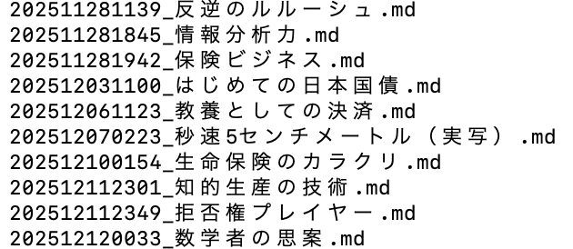
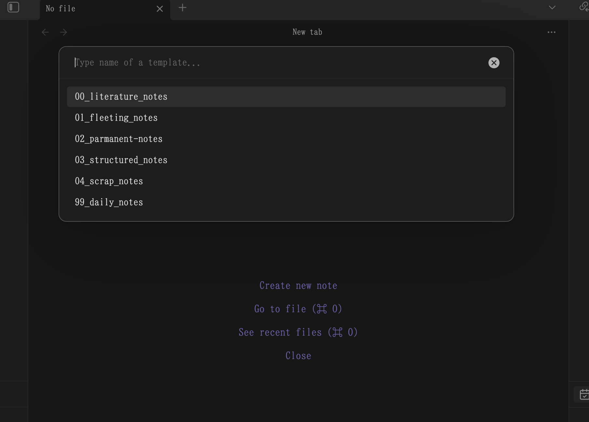
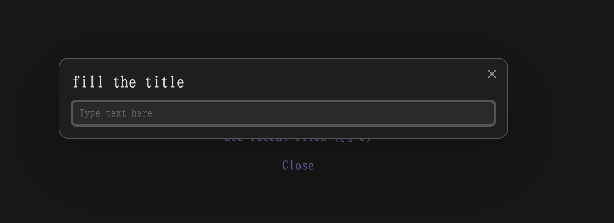
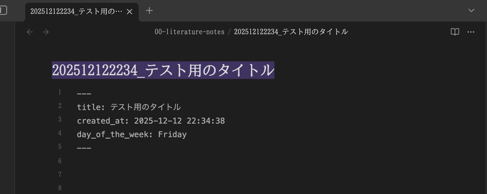

これは、[TSG Advent Calendar 2025](https://adventar.org/calendars/12405) の 13 日目の記事です。

---


## こんな感じでファイルを生成している
私の Obsidian はこんな感じのフォルダ構成になっている。
二桁数字付きがメインで使っているフォルダだ。

```
> ls
00-literature-notes
01-fleeting-notes
02-permanent-notes
03-structured-notes	
04-scrap-notes
99-daily-notes
_attachments
_handy_memo
_templates
_scripts
```

たとえば、`00-literature-notes` フォルダには以下のような `YYYYMMDDHHmm-ファイル名.md` 形式のタイムスタンプ付きファイルが保存されている。




注目してほしいのは、タイムスタンプがファイル名の先頭に付与されており、かつ自然言語のタイトルがその後に続いている点だ。
このようにすると、一意のタイトルを付与できるし、作った順にファイルが並ぶ。

とくに並び順が時系列になっているのがいい。
複数人で共有するドキュメントになると、時系列での管理は限界があると思うのですが、個人レベルのファイル管理では結構便利だ。
「数日前に書いたあれ」とか「去年の二月くらいに書いたあれ」みたいな感じで情報を探したいことが多いからだ。
時系列で自分がやってきたことを確認したいこともあるし、検索クエリを考えるより該当する日付のファイルを全探索したほうが速いこともある。

なお、時系列で並べることなどは、フロントマターとなんらかのコミュニティプラグインや Bases プラグインを使えばできそうだが、他のファイルビュワーなどで開いたときもわかりやすいように、ファイル名にタイムスタンプを付与する方法を採用している。

さて、このような管理をするときに、いちいち日付を手動で入力するのは面倒。
そこで、以下のような手順でファイルを作れるようにしてある。

Cmd + N を押すと、以下のようなポップアップが出てくる。


テンプレートを選ぶと、タイトル入力欄が出てくる。



タイトルを入力すると、以下のようにタイムスタンプ付きのファイルが所定のフォルダに作成される。



## 設定方法
設定方法は以下の通り。
肝は、Templater プラグインのスクリプト機能を使う点。
意外にリッチな機能を持っており、ファイル作成時に動的に内容を生成できる。

### 1. template ファイルを作成する

`_templates` フォルダに、たとえば `literature-note-template.md` という名前で以下の内容のテンプレートファイルを作成する。
`/00-literature-notes/` の部分は、実際にノートを保存したいフォルダに変更する。

```
---
title: <%*
const folder = "/00-literature-notes/"
// frontmatter と file のタイトルを統一する
const title = await tp.system.prompt("fill the title");
tR += `${title}`;
await tp.file.move(folder + `${tp.date.now("YYYYMMDDHHmm")}_${title.replace(/\s+/g, '-')}`)
%>
created_at: <% tp.date.now("YYYY-MM-DD HH:mm:ss") %>
day_of_the_week: <% tp.date.now("dddd") %>
---

<% tp.file.cursor(1) %>
```

### 2. Templater プラグインをインストール・設定する
`Templater` コミュニティプラグインをインストールして、`_templates` をテンプレートフォルダとして設定し、
`Automatic jump to cursor` を有効にする。

また、Hotkeys の設定で、Templater: Create new note from template コマンドにショートカットキー（たとえば Cmd + N）を割り当てる。
デフォルトでは Obsidian の新規ノート作成コマンドに割り当てられているので、そちらの割り当ては外しておく。


以上でセットアップは終了で、設定したホットキー（`Cmd + N`など）を押すとテンプレートからノートを作成できるようになる。
他のフォルダ用のテンプレートも同様に作成すればよい。