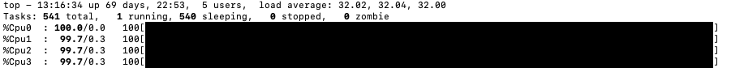

これは、[TSG Advent Calendar 2025](https://adventar.org/calendars/12405) の 14 日目の記事です。

-----


管理しているサーバーにおいて、第三者による不正アクセスが発生し、任意のコードを実行されていた。
調査の結果、マイニング用マルウェアとバックドアが設置されていた。
幸い、root権限は無事で致命的な機密情報の漏洩は確認されなかった。

## 概要と被害状況

事象の発端は、2025年12月7日の昼過ぎ、サーバー上のアプリケーションにアクセスできないことに気づいたことだった。
SSHでログインしようとしたところ、シェルが正常に読み込まれず、`top` コマンド等で確認するとCPU使用率が100%に張り付いていた。



調査の結果、以下の被害が確認された。

- 12月6日 2143頃から翌7日 1318までの約15時間、CPUリソースがクリプトマイニングにより占有された。
- ユーザーディレクトリおよび `/tmp` 配下に、不正な実行ファイル（マイナー、バックドア等）が設置された。

## 侵入経路：Next.js の脆弱性とファイヤーウォールの不備

直接的な原因は、12月4日に公開された Next.js の脆弱性だと思われる。
pm2 のログに不審なペイロードが記録されており、かつ Next.js のディレクトリに`pwned` というファイルが置かれていたことから、そう判断した。

cf. [https://github.com/vercel/next.js/security/advisories/GHSA-9qr9-h5gf-34mp](https://github.com/vercel/next.js/security/advisories/GHSA-9qr9-h5gf-34mp)  
cf. [https://forest.watch.impress.co.jp/docs/news/2068815.html](https://forest.watch.impress.co.jp/docs/news/2068815.html)

本来、このサーバーは Google アカウント認証を行う `oauth2proxy` を前段に挟んでおり、認証済みユーザー以外は Next.js アプリケーションに到達できない構成にしていた。身の回りが忙しい時期だったこともあって、これを理由にアップデートを後回しにしてしまっていた。
しかし、ファイヤーウォールが無効化されていたため、攻撃者は `oauth2proxy` を介さず、Next.js が稼働しているポートへ直接リクエストを送ることが可能な状態だった。

普通に私の手抜かりなのだが、一応言い訳をするとサーバーセットアップ時にファイヤーウォールは有効化していた。
ただ、ファイヤーウォールの起動時の自動化設定まで確認していなかった。
そのため、以前再起動した際、ファイヤーウォールが無効化されていた。

## 観測されたマルウェア

解析まわりの知識は全然ないので、発見された不審なプロセスやファイルを `strings` コマンドで Gemini 3.0 に解析してもらった結果、以下のようなマルウェアが設置されていたらしい。

| 発見ファイル名 | 解説 |
| --- | --- |
| solra | マイナーの展開・監視を行うBotnetランチャー。Go言語製でUPX圧縮されていた。 |
| dockerd | XMRig, Dockerデーモンに偽装したマイニングツール。これがCPUを100%占有していた。 |
| ntpclient | NTPクライアントに偽装したリバースプロキシツール。外部からの裏口（バックドア）として機能する。 |
| health.sh | 競合する他のマイニングプロセスや高負荷プロセスを強制終了させる監視スクリプト。 |

特に `health.sh` は以下のような挙動をしており、他のマルウェアを排除してリソースを独占しようとする意図が見える。

```bash
while true; do
    for proc_dir in /proc/[0-9]*; do
        pid=${proc_dir##*/}

        if strings "/proc/$pid/exe" 2>/dev/null | grep -q xmrig; then
            kill -9 "$pid"
            continue
        fi
        result=$(ls -l "/proc/$pid/exe" 2>/dev/null)
        case "$result" in
            *"(deleted)"* | *"xmrig"*)
                kill -9 "$pid"
                ;;
        esac
    done
    sleep 45
done
```

## 時系列

| 日時 | 出来事 |
| --- | --- |
| 12/04 | Next.js の脆弱性情報が公開される |
| 12/06 2143 | 攻撃者が侵入し、マイニングプロセス（bot）が稼働開始 |
| 12/07 1305 | サーバーの応答なしに気づき調査開始。CPU 100%を確認 |
| 12/07 1318 | 不審なプロセスを特定しKill。調査と復旧を開始 |

## 対応

不審なプロセスをすべて停止した。
`auth.log` や `nginx` のログ、`crontab`、`~/.ssh/authorized_keys`、`.bashrc` などを確認し、永続化の仕組みが残っていないか調査した。
幸い、root権限での怪しい操作ログは見当たらず、攻撃は侵入した一般ユーザー権限の範囲内に留まっていたようだった。

- `sudo systemctl enable ufw` を実行
- Next.js のバージョンを修正パッチ適用済みのバージョン（15.1.2 -> 15.5.7）へアップデート。
- 認証情報のローテーション


現状、不審な挙動は収まっているが、サーバーはネットワークから隔離している。
タイミングを見てOSのクリーンインストールを行う予定。

## おわりに

マイニングツールが設置されたというおなじような話が散見される。

- [React2Shell Exploitation Delivers Crypto Miners and New Malware Across Multiple Sectors](https://thehackernews.com/2025/12/react2shell-exploitation-delivers.html)
- [Next.jsの脆弱性を数日放置したら暗号通貨マイナーを仕込まれた話 #CVE-2025-55182 - Qiita](https://qiita.com/KeppyNaushika/items/53936b0ef3f87104e398)
- [個人開発のEC2が乗っ取られてMoneroを掘られていた話【CVE-2025-55182】｜ねころこ](https://note.com/nekoroko/n/n729421e1cf8d)


攻撃を受けた感想としては、とりあえずデータの暗号化とかをされないで、マイニングだけでよかったという感じ。
あと、データが無事だったという前提のうえで、攻撃者の痕跡を探すのは結構楽しかったので、そのうちハニーポットをたててもいいかもしれない。

## 詳細ログ
以降は、自分用のメモのうち公開しても問題なさそうな部分を抜粋。

### 発見されたファイルの一覧

攻撃者の具体的な行動ログは不明。外部に保存された監査ログ等は存在しない。また、pm2 のログはタイムスタンプを表示していない。以下の表は、ls コマンドで表示されるファイルの最終更新日を記録しているが、改竄されている可能性がある。


| 発見場所 | ファイル最終更新日（ls） | ファイル名 | 
| --- | --- | --- | 
| ~/ | 12月  5 1649 | .systemd-utils |
| ~/nextjs-project/  | 12月  5 2214  | solra |
| /tmp/ | 12月  5 2214 | .del |
| /tmp/ | 12月  5 2233 | fghgf |
| /tmp/ | 12月  6 0204 | health.sh |
| /tmp/ | 12月  6 0228 | 2bd3f45atcp |
| ~/nextjs-project/  | 12月  6 0446  | .pwned |
| /tmp/ | 12月  6 0628 | s.sh |
| /tmp/ | 12月  6 1104 | dockerd |
| /tmp/ | 12月  6 1650 | .javax |
| /tmp/ | 12月  6 1720 | config.json |
| ~/nextjs-project/  | 12月  6 1920  | s.sh |
| /tmp/ | 12月  6 2143 | bot |
| /tmp/ | 12月  6 2143 | bot.1 |
| ~/ | 12月  6 2143 | updates.tar.gz |
| ~/ | 12月  6 2143 | lBYde/ |
| /tmp/ | 12月  7 1318 | docker-daemon |


### 各ファイルの詳細


#### lBYde/7Bua

updates.tar.gz を展開した中身。

```
> ls lBYde/*
lBYde/7BuA		lBYde/SHA256SUMS	lBYde/config.json

lBYde/xmrig-6.22.2:

> cat lBYde/config.json 
{
    "api": {
        "id": null,
        "worker-id": null
    },
    "http": {
        "enabled": false,
        "host": "127.0.0.1",
        "port": 0,
        "access-token": null,
        "restricted": true
    },
    "autosave": true,
    "background": false,
    "colors": true,
    "title": true,
    "randomx": {
        "init": -1,
        "init-avx2": -1,
        "mode": "auto",
        "1gb-pages": false,
        "rdmsr": true,
        "wrmsr": true,
        "cache_qos": false,
        "numa": true,
        "scratchpad_prefetch_mode": 1
    },
    "cpu": {
        "enabled": true,
        "huge-pages": true,
        "huge-pages-jit": false,
        "hw-aes": null,
        "priority": null,
        "memory-pool": false,
        "yield": true,
        "max-threads-hint": 100,
        "asm": true,
        "argon2-impl": null,
        "cn/0": false,
        "cn-lite/0": false
    },
    "opencl": {
        "enabled": false,
        "cache": true,
        "loader": null,
        "platform": "AMD",
        "adl": true,
        "cn/0": false,
        "cn-lite/0": false
    },
    "cuda": {
        "enabled": false,
        "loader": null,
        "nvml": true,
        "cn/0": false,
        "cn-lite/0": false
    },
    "donate-level": 1,
    "donate-over-proxy": 1,
    "log-file": null,
    "pools": [
        {
            "algo": null,
            "coin": null,
            "url": "donate.v2.xmrig.com:3333",
            "user": "YOUR_WALLET_ADDRESS",
            "pass": "x",
            "rig-id": null,
            "nicehash": false,
            "keepalive": false,
            "enabled": true,
            "tls": false,
            "tls-fingerprint": null,
            "daemon": false,
            "socks5": null,
            "self-select": null,
            "submit-to-origin": false
        }
    ],
    "print-time": 60,
    "health-print-time": 60,
    "dmi": true,
    "retries": 5,
    "retry-pause": 5,
    "syslog": false,
    "tls": {
        "enabled": false,
        "protocols": null,
        "cert": null,
        "cert_key": null,
        "ciphers": null,
        "ciphersuites": null,
        "dhparam": null
    },
    "dns": {
        "ipv6": false,
        "ttl": 30
    },
    "user-agent": null,
    "verbose": 0,
    "watch": true,
    "pause-on-battery": false,
    "pause-on-active": false
}

```


##### Gemini 3.0 Pro による strings の解析結果（未検証）
> 提供された `strings` コマンドの出力ファイルを解析しました。
> 
> **結論:**
> このファイルは、オープンソースの高性能暗号通貨マイニングソフトウェアである **XMRig バージョン 6.22.2** の Linux 用実行バイナリ（またはそのダンプ）です。
> 
> 以下に、そのように判断した根拠となる文字列と解析内容をカテゴリ別に示します。
> 
> ### 1. ソフトウェアの特定 (Identity)
> このファイルが XMRig であることは、バージョン情報やヘルプメッセージがそのまま含まれていることから明白です。
> 
> * **ソフトウェア名とバージョン:**
>     * `XMRig 6.22.2`
>     * `Usage: xmrig [OPTIONS]`
> * **ビルド情報:**
>     * ` built on Nov  3 2024 with GCC`
>     * `GCC: (Alpine 13.2.1_git20231014) 13.2.1 20231014`
>     * この情報から、Alpine Linux環境（軽量Linuxディストリビューション）でビルドされたことがわかります。
> 
> ### 2. 機能と目的 (Functionality)
> 暗号通貨のマイニング（採掘）を行うための機能に関する文字列が多数含まれています。
> 
> * **マイニングプールへの接続:**
>     * `       URL of mining server`
>     * `from [1;37m%s:%d%s[0m diff [1;37m%lu%s` (プールからのジョブ受信と難易度)
>     * `[1;32maccepted` (計算結果がプールに受理されたログ)
>     * `| DIFFICULTY | EFFORT %% |`
> * **プロトコル:**
>     * `stratum+ssl://`
>     * `stratum+tcp://`
> * **寄付機能 (Developer Donation):**
>     * `--donate-level=N` (開発者への寄付レベル設定)
>     * `dev donate started`
> 
> ### 3. 対応アルゴリズムと通貨 (Algorithms & Coins)
> XMRig は CPU マイニングに特化しており、特に Monero (XMR) で使用される RandomX アルゴリズムに関連する記述が目立ちます。
> 
> * **対応通貨:**
>     * `Monero`, `Ravencoin`, `Wownero`
>     * `Zephyr`, `Townforge`, `YadaCoin`
> * **アルゴリズム:**
>     * `randomx`
>     * `ghostrider` (Raptoreum用)
>     * `kawpow` (Ravencoin用)
>     * `argon2`
>     * `cryptonight` (古いMoneroのアルゴリズム群)
> 
> ### 4. システム制御と最適化 (System Interaction)
> マイニング効率を最大化するための低レベルなシステム操作に関する文字列が含まれています。
> 
> * **Huge Pages (メモリ最適化):**
>     * `disable huge pages support`
>     * `huge pages %s%3.0f%% %u/%u`
>     * `enable huge pages support for RandomX JIT code`
> * **MSR (Model Specific Registers) Mod:**
>     * CPUのハードウェアレジスタを書き換えて速度を上げる機能です。
>     * `FAILED TO APPLY MSR MOD, HASHRATE WILL BE LOW`
>     * `/sbin/modprobe msr allow_writes=on`
> * **CPU アフィニティとトポロジー:**
>     * `set process affinity to CPU core(s)`
>     * `hwloc/%s` (hwlocライブラリを使用してCPUトポロジーを解析)
> 
> ### 5. 使用されているライブラリ (Dependencies)
> このバイナリに静的リンクされていると思われる主要なライブラリです。
> 
> * **OpenSSL 3.0.15:** 暗号化通信とハッシュ計算に使用。
>     * `OpenSSL 3.0.15 3 Sep 2024`
> * **libuv 1.49.2:** 非同期I/O処理に使用。
>     * `1.49.2` (コンテキスト的に src/uv-common.c の近くにあるため)
> * **hwloc 2.11.2:** ハードウェアの構成情報の取得に使用。
>     * `2.11.2` (hwloc/%s の直下)
> 
> ### まとめ
> このファイルは **XMRig 6.22.2** の実行ファイルです。ユーザーが意図してインストールしたのであれば、Moneroなどの暗号通貨をマイニングするためのツールです。しかし、もし心当たりがない場合、またはシステムのリソース（CPU使用率）が異常に高い場合は、マルウェア感染（クリプトジャッキング）の可能性があります。

#### solra

##### Gemini 3.0 Pro による strings の解析結果（未検証）

> アップロードされたファイル `strings-solra.txt` の内容を解析しました。このファイルは、バイナリファイル（実行可能ファイル）から文字列（Strings）を抽出した結果です。
> 
> 解析結果は以下の通りです。
> 
> ### 結論：Linux用 Go言語製 通信/トンネルツール（UPX圧縮）
> 
> このファイルは、**Linux向け（64bit）の実行可能ファイル**であり、**Go言語**で記述されています。また、**UPX**というツールで圧縮（パック）されています。
> 機能としては、**DNSトンネリング**や**プロキシ**、あるいはそれらを利用した**バックドア（遠隔操作ツール）**の可能性が高いです。
> 
> ---
> 
> ### 詳細な解析と根拠
> 
> #### 1. ファイル形式と圧縮 (Packer)
> このバイナリは **UPX** で圧縮されています。解析するには、通常 `upx -d` コマンドで解凍する必要があります。
> 
> * **根拠となる文字列:**
>     * `UPX!` (ファイルの先頭)
>     * `UPX!` (ファイルの末尾)
>     * `$Info: This file is packed with the UPX executable packer http://upx.sf.net $` (UPXの署名)
>     * `PROT_EXEC|PROT_WRITE failed.` (UPXがメモリ上で展開する際のエラーメッセージ)
> 
> #### 2. プログラミング言語とプラットフォーム
> このプログラムは **Go言語 (Golang)** で書かれており、**Linux x86-64** 環境向けにビルドされています。
> 
> * **根拠となる文字列:**
>     * `Go buildinf:` (Goのビルド情報ヘッダ)
>     * `/lib64/ld-linux-x86-64.so.2` (Linuxの動的リンカ)
>     * `/usr/local/go` (Goの標準ライブラリパス)
>     * `runtime/cgo` (Goのランタイム)
>     * `GOMAXPROCS` (Goの環境変数)
>     * `runtime error:`, `panic:` (Go特有のエラーハンドリングメッセージ)
> 
> #### 3. 機能とライブラリ (通信・暗号化・回避技術)
> 含まれている文字列から、高度な通信機能、暗号化、および検閲回避技術が含まれていることがわかります。
> 
> * **暗号化・セキュリティ:**
>     * `crypto/aes`, `crypto/tls`, `crypto/x509` (標準的な暗号化ライブラリ)
>     * `HMAC`, `SHA1`, `MD5`
>     * `MIICXgIBAAKBgQDu...` (Base64エンコードされた公開鍵または証明書の一部)
>     * `chacha20poly1305` (比較的新しい強力な暗号方式)
> 
> * **通信プロトコルと回避技術:**
>     * **KCP:** `` や `` 周辺に見られる挙動や、Go製ツールでよく使われる `kcp-go` (UDPベースの高速通信プロトコル) の痕跡があります。
>     * **SMUX:** ストリーム多重化ライブラリ（`smux`）の痕跡が見られます（KCPとセットで使われることが多い）。
>     * **DNSトンネリング / DoH:**
>         * `DoH` (DNS over HTTPS)
>         * `dns`, `CNAME`, `TXT`, `A`, `AAAA` (DNSレコード操作)
>         * `lookupe`, `udp`, `tcp`
>     * **HTTP/2 & QUIC:**
>         * `PRI * HTTP/2.0` (HTTP/2のプリフィックス)
>         * `ChunkedReader` (HTTP通信の処理)
> 
> * **プロキシ/トンネル:**
>     * `127.0.0.1` (ローカルホスト)
>     * `User-Agent` (HTTPクライアントとしての動作)
> 
> #### 4. ファイル名「solra」について
> ファイル名にある `solra` という文字列自体は、このテキストダンプの中には明確なパスとしては現れていません（`strings-solra.txt`というファイル名自体を除く）。しかし、`` に `solra` という文字列が断片的に見えます。
> マルウェアの中には「Solra」という名前のバックドア型トロイの木馬が存在しますが、この文字列の内容（Go言語、UPX、KCP/DNS機能）からすると、以下のツールである可能性が高いです。
> 
> * **可能性1: DNSTT (DNS Tunneling Tool)**
>     * Go言語製で、DNS over HTTPS (DoH) や KCP を使用して検閲を回避するツールです。構成要素が非常に似ています。
> * **可能性2: カスタムRAT (Remote Access Trojan) / バックドア**
>     * KCPやSMUXを使用してC2サーバー（指令サーバー）と高速かつ隠蔽された通信を行うマルウェアの可能性があります。`execInChild` などの文字列は、外部コマンドの実行能力を示唆しています。
> 
> ### まとめ
> このファイルは、**Linux上で動作し、通信を暗号化・隠蔽（DNSトンネルやUDP高速化プロトコルを使用）しながら外部と接続するツール**です。意図してインストールしたものであれば「検閲回避プロキシ（dnsttなど）」ですが、身に覚えがない場合は「バックドア（不正アクセス用プログラム）」である可能性が高いです。

#### dockerd
`/tmp` に置かれていた。CPU を占有していたのは`docker-daemon` という名前のプロセスだったので、マイニング用だと思われる。
`tmp` は消えるのを忘れていて、ファイルを保存する前に reboot してしまったので、実際のファイルはない。

#### ntpclient

`~/.systemd-utils` ファイルに、`.systemd-utils/conf` と一緒に入っていた。`conf` はおそらく bot の ID？

```
> cat .systemd-utils/conf 
fawefkioawjgioaw... みたいなランダム文字列
```

##### Gemini 3.0 Pro による strings の解析結果（未検証）
> 提供された `strings-ntpclient.txt` の内容を解析しました。
> 
> **結論:**
> このファイルは、ファイル名 (`ntpclient`) が示唆するような「時刻同期クライアント (NTP Client)」**ではありません**。
> その正体は、**「xfrpc」** という名前のツール、あるいは **「frp (Fast Reverse Proxy)」** をベースにした **リバースプロキシクライアント/バックドアツール** です。OpenWrt などの組み込み Linux デバイス向けにコンパイルされている可能性が高いです。
> 
> 以下に、解析結果とその根拠を示します。
> 
> ### 1. ソフトウェアの正体：xfrpc / frp
> このバイナリは、NAT やファイヤーウォールの裏にある端末を外部に公開するためのリバースプロキシツールです。
> 
> * **根拠:**
>     * [cite_start]`[nss] xfrpc subprocess exit` や `[nss] create_xfrpc_thread_args` といったログメッセージが含まれており、ツール名が **xfrpc** であることが分かります [cite: 16]。
>     * [cite_start]`libxf-2.9.644/main.c` というソースコードパスが含まれており、`libxf` というライブラリ（frp の派生またはフォーク）を使用しています [cite: 18]。
>     * [cite_start]`[nss] Found %d frps configurations` や `[common] server_addr = %s` など、有名なリバースプロキシツール **frp (frp-server/frp-client)** と互換性のある設定フォーマットや参照が見られます [cite: 16]。
> 
> ### 2. 機能：強力なネットワークトンネリングと制御
> 単なる通信中継だけでなく、システムを遠隔制御するための多機能な機能を持っています。
> 
> * **プロキシ・トンネリング機能:**
>     * [cite_start]**HTTP/HTTPS/TCP/UDP:** `type = http`、`local_port`、`custom_domains` などの設定文字列から、Web サーバーや TCP 通信を中継する機能があります [cite: 16]。
>     * [cite_start]**SOCKS5:** `socks5` や `socks5_proxy_connect` という文字列があり、SOCKS5 プロキシとしても動作します [cite: 27, 49]。
>     * [cite_start]**FTP:** `_ftp_remote_ctl_proxy` という記述があり、FTP 通信のプロキシもサポートしています [cite: 28]。
>     * [cite_start]**WebSocket:** `Upgrade: websocket` や `ws-bridge` の記述があり、WebSocket を使って通信を隠蔽・カプセル化している可能性があります [cite: 18]。
> 
> * **遠隔操作・侵入維持機能:**
>     * [cite_start]**Telnet サーバー:** `Starting telnetd on port %d` や `libxf-2.9.644/plugins/telnetd.c` という記述があり、内部で Telnet サーバーを立ち上げてシェルアクセスを提供する機能があります [cite: 25]。
>     * [cite_start]**ユーザーアカウント操作:** `sudo useradd`、`sudo chpasswd`、`sudo usermod` という文字列が含まれており、システムに新しいユーザーを追加したり、パスワードを変更したりする危険な機能を持っています [cite: 27, 28]。
> 
> ### 3. ターゲット環境：OpenWrt / 組み込み Linux
> このバイナリは、ルーターや IoT デバイスなどの組み込み Linux 環境（特に OpenWrt）をターゲットにしている痕跡があります。
> 
> * **根拠:**
>     * [cite_start]`OpenWrt%s` や `procd` (OpenWrt のプロセス管理ツール) という文字列が明示的に含まれています [cite: 17]。
>     * [cite_start]`/etc/config` などの OpenWrt 特有のパスは見当たりませんが、`br-lan` (ブリッジインターフェース名) や `working in router` という文字列があり、ルーター上で動作することを想定しています [cite: 19]。
>     * [cite_start]`init`、`systemd`、`upstart`、`openrc` などの様々な init システムを検出するロジックが含まれています [cite: 17]。
> 
> ### 4. なぜ "ntpclient" という名前なのか？
> * **隠蔽工作 (Masquerading):**
>     中身はリバースプロキシツール (`xfrpc`) ですが、プロセス一覧で管理者に見つかりにくくするために、一般的なシステムプロセスである `ntpclient` (時刻同期ツール) に偽装している可能性が極めて高いです。
> * **マルウェア/バックドアの可能性:**
>     正規の `frp` や `xfrpc` を管理者が意図してインストールした場合もありますが、ファイル名が偽装されている点、および `useradd` などの攻撃的な機能が含まれている点から、ルーターに感染するボットネット（Mirai の亜種など）や、攻撃者が設置したバックドアである疑いがあります。
> 
> ### 5. 使用されているライブラリ
> 解析により、以下のライブラリが静的リンクされていることが確認できます。
> * [cite_start]**OpenSSL 1.0.2t (2019年9月):** 暗号化通信に使用されています。バージョンが古く、脆弱性が既知のものです [cite: 80]。
> * [cite_start]**Libevent:** 非同期イベント通知ライブラリ。ネットワーク通信の処理に使用されています [cite: 54, 66]。
> * [cite_start]**zlib:** データ圧縮に使用されています [cite: 79]。
> * [cite_start]**JSON-C:** JSON データの解析に使用されています [cite: 79]。
> 
> ### まとめ
> このファイルは **「ntpclient という名前にリネームされた、OpenWrt/Linux ルーター向けの xfrpc (frp 互換) リバースプロキシツール」** です。外部から内部ネットワークへの侵入経路（トンネル）を作成するために使用されるツールです。

#### health.sh

```bash
while true; do
    for proc_dir in /proc/[0-9]*; do
        pid=${proc_dir##*/}

        if strings "/proc/$pid/exe" 2>/dev/null | grep -q xmrig; then
            kill -9 "$pid"
            continue
        fi
        result=$(ls -l "/proc/$pid/exe" 2>/dev/null)
        case "$result" in
            *"(deleted)"* | *"xmrig"*)
                kill -9 "$pid"
                ;;
        esac
    done
    sleep 45
done
```


## 攻撃の発覚
2025-12-07 1300 ごろにサーバーのアプリケーションにアクセスできないことに気づく。最後にアクセスできたのは、前日 2025-12-06 の1930ごろ。ssh をして、`pm2 restart 0` をした。
サーバーに入ると bashrc が読み込まれず、node, npm, volta, pm2, cargo といったコマンドを実行すると「強制終了」と表示される。top を実行すると、CPU使用率が100%になっている。

ホームディレクトリに`lBYde`という見慣れないフォルダや`updates.tar.gz` というファイルがあったことから、サーバーに侵入されマイニングされていると判断。プロセスを kill する。


## 侵入経路の検討

この時点で、Next.js の RSC の脆弱性が数日前に話題になっていたので、それが侵入経路かとあたりをつける。ただ、前段に oauth2proxy を挟んでいるため、攻撃者のリクエストは Next.js まで届かないはず。それを理由に対応を後回しにしていたのだから。
実際に、http でも https でも oauth2proxy を回避することはできない。

とはいえ、そこが一番怪しいので、pm2 のログを確認してみると、以下のコマンドで`~/.pm2/logs/error.log` がヒットする。
```bash
$ grep -r "updates.tar.gz" ~/.pm2/logs/
~/.pm2/logs/error.log:    '**updates.tar.gz**\n' +
```

問題はなぜ oatuh2proxy を迂回できたか。これは、ファイヤーウォールを全開にしてたからだった。
firewall が起動時に有効化される設定になっておらず、以前に起動し直したときに無効化されていたと思われる。これにより、IPアドレスとポートを直接指定することで Next.js にリクエストが届く状態になっていた。

以下のように対応した。

```bash
$ sudo systemctl enable ufw
$ sudo systemctl is-enabled ufw
enabled
```

### root 権限をとられているか検討
とられていないと思われる。

- Next.js 起点の攻撃で、nextjs の実行ユーザーは普通のユーザーだった
- 一応 Next.js の実行ユーザーは sudo のパスワードを設定していた
- sudo を使えばできそうないろんなこと（他のユーザーフォルダへのアクセスとか）がされてなかった
- auth.log の調査の結果、不審な点はなかった
