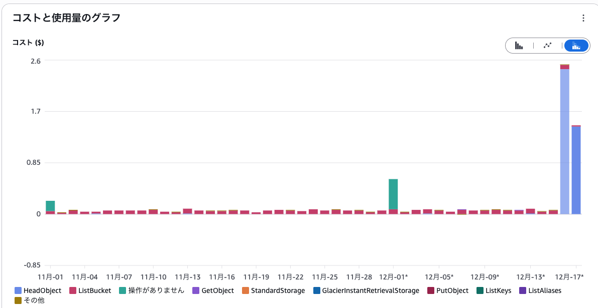
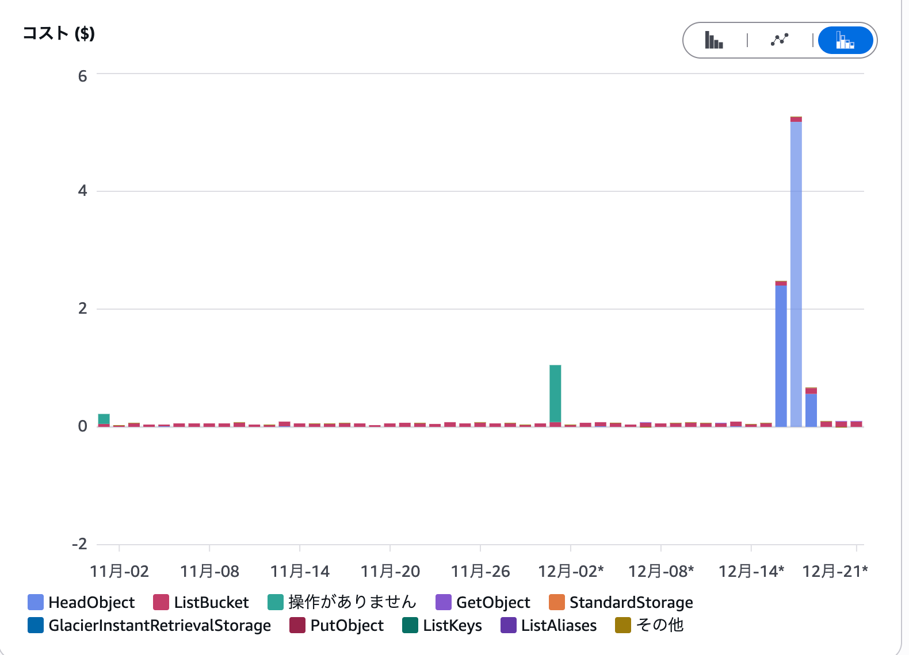

これは、[TSG Advent Calendar 2025](https://adventar.org/calendars/12405) の 23 日目の記事です。

-----

Obsidianの同期方法として、AWS S3と [remotely-save](https://github.com/remotely-save/remotely-save) のセットアップをした。
AWS S3 を使う場合は、"Use Accurate MTime" を有効化する必要はなく、むしろ無効化しておかないと、HEAD API リクエストが大量に発生してしまい、思わぬ高額請求が来る可能性がある、という話。

## 検証環境と初期設定

同期環境の構成は以下の通りである。

- PC（Mac）、スマートフォン（Android）間で同期
- AWS S3 をストレージとして使用
- 同期するファイル数は約4,000ファイルくらい

S3 標準ストレージの保管コストは `$0.023 / GB / month`（東京リージョン）であるため、数GB程度のデータであれば、ストレージ料金自体は月額数十円程度に収まる計算となる。

同期の設定方法についてはとくにいうことはないので、省略。

## コストアラートがきた

運用開始から2日後、AWS Budget からアラートがきた。以前設定していた月額予算 $5 を超過しそう、とのこと。
Cost Explorerで内訳を確認したところ、ストレージ保管料ではなく、HEAD の APIリクエスト料金によってコストが急増していた。

一日で$2.5くらい使っている計算になるので、一ヶ月気づかなかったら¥12,146くらいになっていた。
クラウド破産まではいかないけど、結構痛い。

[S3 料金](https://aws.amazon.com/jp/s3/pricing/) によると、「東京のGET、SELECT、および他のすべてのリクエスト (1,000 件のリクエストあたり)の料金」は、「S3 標準 – 低頻度アクセス」 で 0.001 ドル。
4000ファイルくらいあったので、一回あたりの同期で0.004ドル。1min ごとに同期してたから、(0.004ドル/回) * (60分) * (24時間) = 5.76ドル/日。
2台分だから、11.52ドル。

実際に来ている請求とはズレがあるけど、ファイルのうち2/3くらいは「低頻度アクセス」クラスだが、1/3 くらいはリクエストの単価が低い「標準」クラスであることと、スリープしてるときは動いていないだろうし、理論値としてはこんなもんか

## Use Accurate MTime を有効化していた

原因は、remotely-save の設定項目である "Use Accurate MTime" を有効にしていたこと。
設定項目にきちんとコストがかかる旨の注意書きがあったが、同期の正確性のほうが大事かな、と思ってなんとなく有効化していた。

この機能は、以下のコミットで追加されたやつだけど、何がどう accurate なのか書いてなかった。

- [Release 0.3.35 · remotely-save/remotely-save](https://github.com/remotely-save/remotely-save/releases/tag/0.3.35)
- [s3 mtime · remotely-save/remotely-save@29a3c76](https://github.com/remotely-save/remotely-save/commit/29a3c76b4e656168412fa125c8b0ee33e91f8fcc)
- https://github.com/remotely-save/remotely-save/blob/34db181af002f8d71ea0a87e7965abc57b294914/src/fsS3.ts#L470

おそらく、LIST API で取得できる時間と HEAD API で取得できる時間に差があって、HEAD API を使うことで正確な更新時間を取得できるようにしているのだと思う。
ただ、AWS S3 に関していえば、2020年のアップデートにより[強力な書き込み後の読み取り整合性](https://aws.amazon.com/jp/blogs/news/amazon-s3-update-strong-read-after-write-consistency/)があり、HEAD と LIST の両方で最新の情報が取得できるはずなので、accurate mtime を有効にする必要はなさそう。

AWS S3 以外のS3互換実装では製品や構成に依存して、今でも不整合が残っている可能性があるかもしれないので、個別製品のドキュメントを確認するのが良いと思う。

## 対策と結果

remotely-saveの設定で "Use Accurate MTime" を無効化 した。

設定変更後の Cost Explorer のスクリーンショットが以下の通りで、問題なさそう。

## その他の考慮事項

コスト面以外の運用上の課題として、以下のようなこともあった。

1. 大容量ファイルの同期: 33MBの動画ファイルの同期時にエラーが発生した。挙動としては何のメッセージもなく obsidian が落ちるというもの。設定で「Large file」の同期スキップを有効化し、閾値を20MBに設定した。
2. 競合の発生: PCでノートを書いていたら、スマホ側に同じタイトルのノートが二つできていた。片方はPC側で書きかけていたやつで、もう片方はPC側で書き終わったときのやつ。まだ結構不安定というか、安心して使えるようにはなっていない。
3. スマホ側で発火する同期が微妙かも。1min おきに同期するようにしてみたけど、1min たっても変更が同期しない。そこまで頻繁に同期する必要もないので、妥協する

軽く調べると、環境によっていろんなことが起きるようなので、自分で解決したくない人は Obsidian Sync を使うのが無難かもしれない。

- [ObsidianのRemotely Saveを利用してみた - dolvlog](https://roodolv.dev/posts/2024/09/obsidian-remotely-save/)
	- スマホだと同期が遅くなる現象
- [ObsidianにRemotely Saveを導入した - umemak](https://umemak.github.io/blog/posts/2024/04/21_obsidian_remotely_save/)
	- E2E encryptionを設定したら、iPhone8やiPad air4には重すぎたようで同期が完了しないことがしばしば。 暗号化しなければ常識的な時間で同期できる
- [Obsidianをこねこね](https://zenn.dev/hotate29/scraps/461171728b8117)
	- icloud でも同期がうまくいかないことがあるらしい。

## まとめ

気づかなければ1万円以上を一ヶ月で払うことになっていたわけで、アラートは偉大。