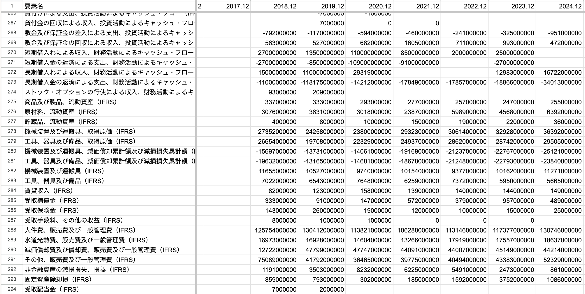
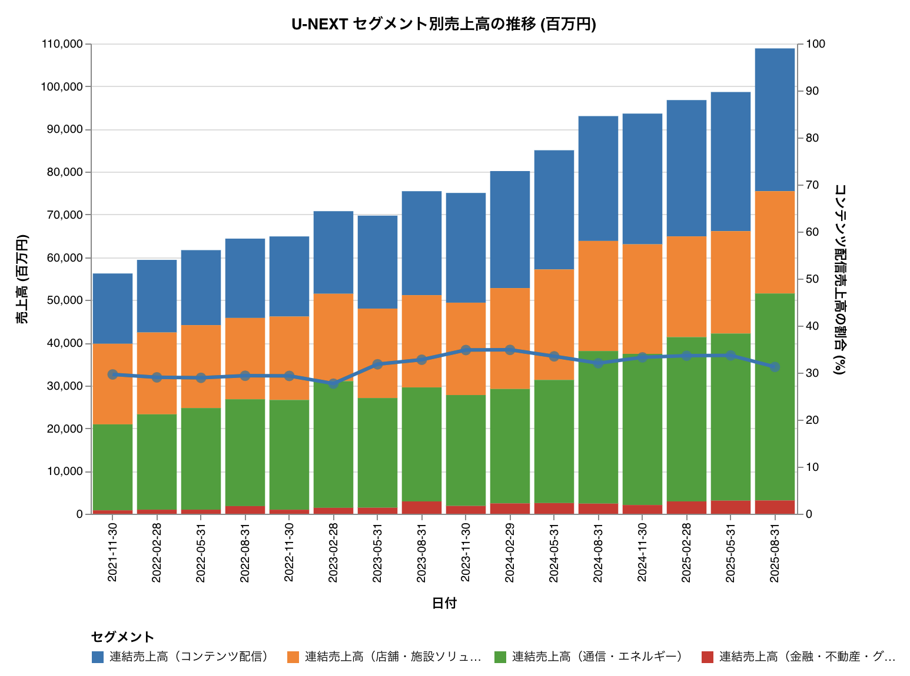
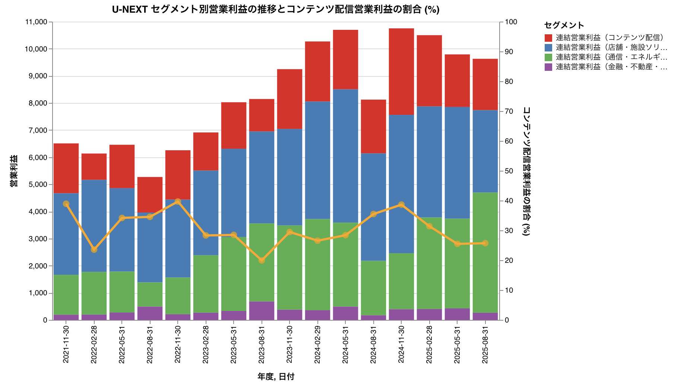
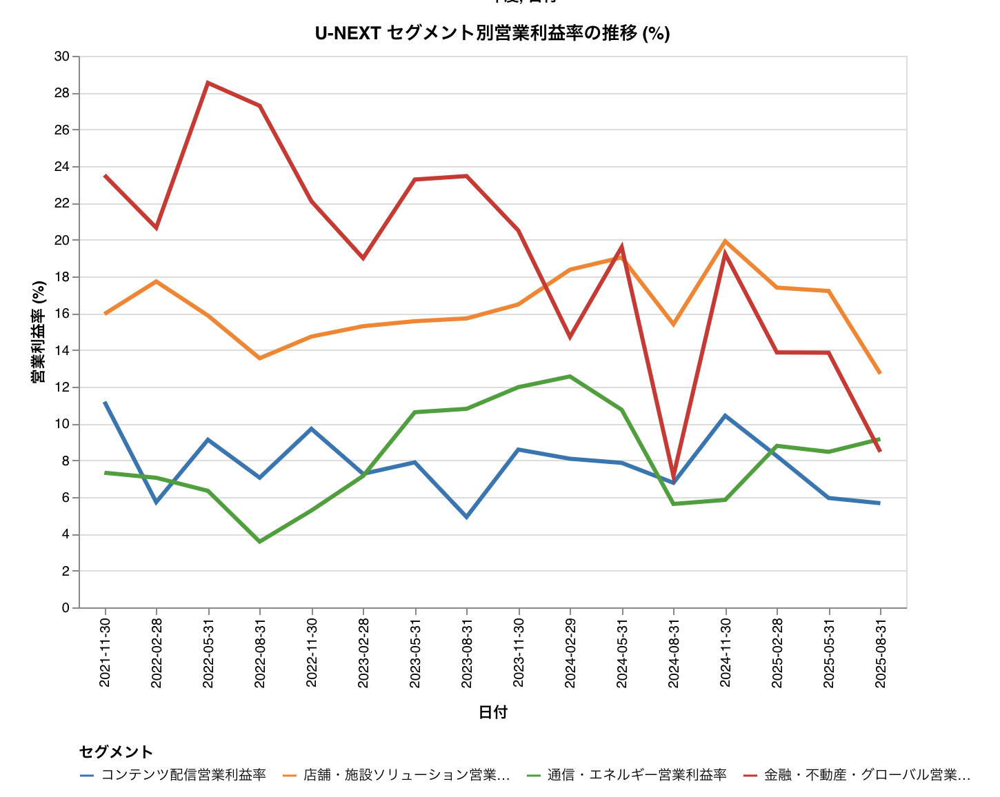

これは、[TSG Advent Calendar 2025](https://adventar.org/calendars/12405) の 25 日目の記事です。

---

以下が作ったツール。

- [EDINET CSV Downloader \- Google Colab](https://colab.research.google.com/drive/1KT-f4vIgpCpRVjsiwtuZvPUIzF6W18NB?usp=sharing)  

上記のリンクを開いて、指示に従って実行すれば、過去10年分の財務データを CSV 形式でダウンロードできる。

## 機能と便利なところ

EDINET が公開している XBRL 由来の CSV を企業ごとに集計し、過去10年分をまとめてダウンロードできる Jupyter Notebook を作成した。Google Colaboratory で公開しているため、ブラウザと Google アカウントがあれば誰でも実行可能。

財務諸表データが通時的に記入された CSV ファイルを自動で生成できる。
以下は、このツールを使って生成したすかいらーくの過去10年分のデータの一部。

企業分析をするときの観点として, 過去の財務データを長期的に見ることは重要。
しかし、EDINET に掲載されている有価証券報告書などは多くの場合、前期分までしか掲載されていないため、過去のデータを遡って取得するのが面倒である。
また、企業ホームページに掲載されているプレゼン用の資料などは、ほしい項目が掲載されていないことが多い。

第三者が作成した各種サービスもあるが、細かい勘定項目を取得できない。

### 想定している使い方
- CSV を表計算ソフトにインポートして、個別の指標を計算したり、グラフを作成したりできる
- CSV を AI に読み込ませて、企業分析をさせる

たとえば、以下は U-NEXT ホールディングスのセグメント別の売上高、営業利益、営業利益率の推移を可視化した例。
セグメントごとに色を揃えていないため非常にみづらいが、ご容赦いただきたい。

### できないこと
各企業で会計基準、勘定項目の使い方が異なるため、各企業を統一の指標で横断的に分析することには向いていない。

また、CSV に掲載されていないようなレベルの細かい指標を取得することもできない。
有価証券報告書の連結財務諸表には内訳が掲載されているが、CSV には掲載されていないこともある。

## おおまかな処理の流れ
金融庁の EDINET API を利用して、提出された書類の CSV ファイル（XBRL から生成されたもの）を取得している。

1. 日付を指定して書類一覧を取得する  
2. 書類一覧から目的の企業の書類 ID を特定する  
3. 書類 ID を指定して CSV をダウンロードする  
4. Zip ファイルを解凍し、必要な勘定科目を抽出して結合する

## ツールの使い方

[作成した Notebook](https://colab.research.google.com/drive/1KT-f4vIgpCpRVjsiwtuZvPUIzF6W18NB?usp=sharing) の概要は以下の通り。

- 指定企業のデータ取得: EDINET コードをカンマ区切りで入力するだけでデータを取得。  
- 期間指定: 過去10年分のデータを取得可能
  - これは EDINET API の仕様上、過去10年分のデータしか取得できないため。  
- 出力されるデータ:  
  - All Data: 全期間のデータを横持ち形式（列に年月、行に勘定科目）で出力。  
  - Annual Data: 通期決算（有価証券報告書）のデータのみを抽出して出力。

使い方は、[ノートブック](https://colab.research.google.com/drive/1KT-f4vIgpCpRVjsiwtuZvPUIzF6W18NB?usp=sharing)の説明を参照してほしい。

## 実際に AI に分析させてみた例

たとえば、すかいらーくホールディングスのデータを取得し、Gemini 3.0 Pro に少しだけ分析させてみた（内容の検証はしていない）。

> 分析例：すかいらーくホールディングス (3197)
> 
> 本ツールを使用して、株式会社すかいらーくホールディングスの過去のデータを取得した。  
> 取得された \_annual.csv から、2018年12月期以降の数値を抜粋する。  
> 
> 表: 売上収益と営業利益の推移（単位: 百万円）
> 
> | 決算期 | 売上収益 (Revenue) | 営業利益 (Operating Profit) | 営業利益率 |
> | :---- | :---- | :---- | :---- |
> | 2018.12 | 366,360 | 22,857 | 6.2% |
> | 2019.12 | 375,394 | 20,561 | 5.5% |
> | 2020.12 | 288,434 | -23,031 | -8.0% |
> | 2021.12 | 264,570 | 18,217 | 6.9% |
> | 2022.12 | 303,705 | -5,570 | -1.8% |
> | 2023.12 | 354,831 | 11,688 | 3.3% |
> | 2024.12 | 401,130 | 24,184 | 6.0% |
> 
> ※ 2024.12 は2025年12月時点での直近通期実績
> 
> 取得したデータを長期的に見ると、以下の傾向が明確になる。
> 
> - コロナ禍の打撃と底打ち: 2019年までは売上3,700億円規模で安定していたが、コロナ禍の影響を受けた2020年から2021年にかけて売上は2,000億円台後半まで大きく落ち込み、2020年には230億円もの巨額の営業赤字を計上している。  
> - V字回復と過去最高売上: その後、客数の回復と価格改定の効果により、2022年から売上は増加基調に戻った。特に2024年12月期には売上収益が4,000億円を突破し、コロナ禍前（2019年）の水準を大きく上回る成長を見せている。  
> - 利益体質の変化: 2022年は原材料高騰の影響で一時赤字となったが、2023年には黒字化。2024年には営業利益241億円を確保し、利益額でもコロナ禍前の2018-2019年水準を超えている。

## ツールの限界と利用上の注意

本ツールは EDINET のデータを機械的に集計するものであり、利用にあたってはいくつかの注意点がある。

### 会計基準や集計方針の変更によるデータの非連続性

企業が会計基準を変更（例：日本基準から IFRS への移行）したり、集計方針を変更したりした場合、同じ勘定科目（要素ID）であっても連続性が失われることがある。

例えば、出前館は、売上高の算出方法が最近変更されている。2025年以降のデータではクーポンの扱いが変わって算入されなくなったため、2024年以前の数値とは単純比較ができない。
ただし、財務諸表の数値だけをみると、そのことがわからない。

このように、数字が急激に変動している場合は、実際の有価証券報告書を参照し、会計方針の変更などの注記を確認する必要がある。

### その他の仕様と注意事項

- 指標の特定: 各指標は 要素ID と additional\_context\_info の組み合わせで一意に特定できる。セグメント情報などの詳細は additional\_context\_info カラムに記載されている。    
- 機械的な集計: AI による解釈などは行わず、提供された CSV を機械的に結合している。元データが正しい限り数値は正確だが、勘定科目のマッピングなどは行わないため、企業ごとの科目の使い分けには注意が必要である。  
- ファイルの使い分け: 出力される \_annual.csv は有価証券報告書（通期）のデータのみを集めたもので、\_all.csv は四半期報告書なども含めた全てのデータ。
