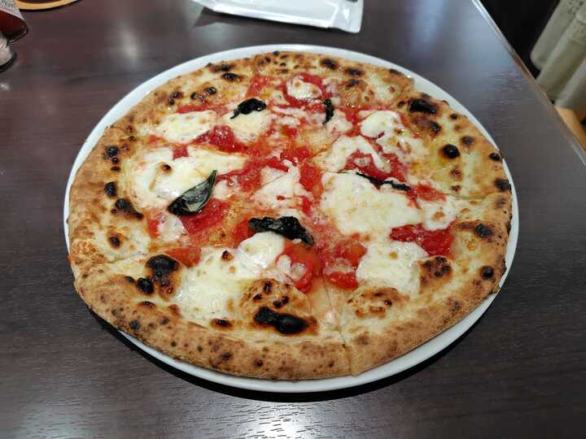
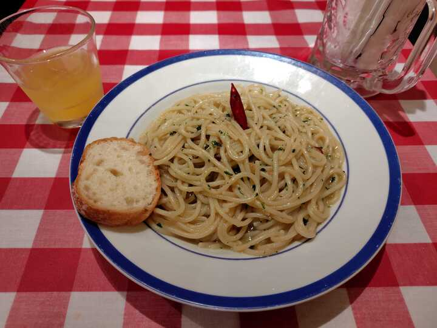
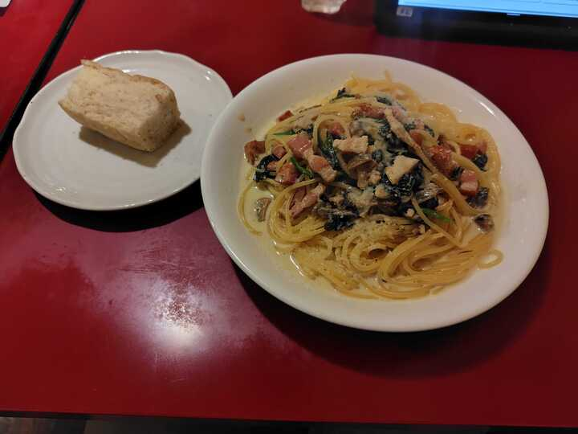
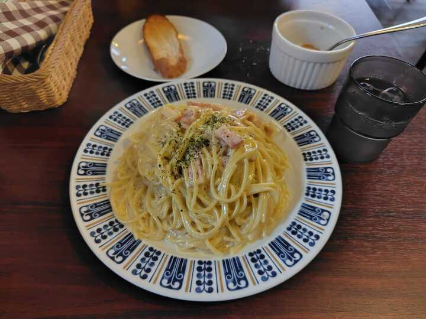

これは、[TSG Advent Calendar 2025](https://adventar.org/calendars/12405) の 24 日目の記事です。

-----

基本的にランチ。学生でも通いやすい価格帯のお店。
以下では、本郷三丁目駅といったら丸の内線の駅のことを指す。
本郷三丁目ユーザーなので、根津や東大前のお店は含めていない。

# 1. ピッツェリア・カロッツェ

ピザのお店。本郷三丁目から歩いて10分かからないくらい。

なんと店内に窯があり、窯で焼いたピザが食べれる。
生地が美味しい。

おすすめは単品1200円のマルゲリータ。

cf. https://tabelog.com/tokyo/A1310/A131004/13198357/

<iframe src="https://www.google.com/maps/embed?pb=!1m18!1m12!1m3!1d6479.667071705484!2d139.75919468720843!3d35.70571380187723!2m3!1f0!2f0!3f0!3m2!1i1024!2i768!4f13.1!3m3!1m2!1s0x60188c22e229f7bf%3A0x85c651269f14082b!2z44OU44OD44OE44Kn44Oq44KiIOOCq-ODreODg-ODhOOCpw!5e0!3m2!1sja!2sjp!4v1766507390236!5m2!1sja!2sjp" width="600" height="450" style="border:0;" allowfullscreen="" loading="lazy" referrerpolicy="no-referrer-when-downgrade"></iframe>

# 2. ビストロ Urushi

本郷三丁目駅から徒歩5分くらい。
ラストオーダーは13時30分。
支払いは現金のみ。

目玉は1200円のウニのパスタ。サラダとスープもついている。
値段に見合わないほどのウニが入っていて、バグってる。

 
 

cf. https://tabelog.com/tokyo/A1310/A131004/13281281/

<iframe src="https://www.google.com/maps/embed?pb=!1m18!1m12!1m3!1d3239.7773379968125!2d139.7593548762108!3d35.70709657257892!2m3!1f0!2f0!3f0!3m2!1i1024!2i768!4f13.1!3m3!1m2!1s0x6018f4d3837e2b55%3A0xb6495d5e93803bc!2z44OT44K544OI44OtVXJ1c2hp!5e0!3m2!1sja!2sjp!4v1766507348947!5m2!1sja!2sjp" width="600" height="450" style="border:0;" allowfullscreen="" loading="lazy" referrerpolicy="no-referrer-when-downgrade"></iframe>

# 3. ピアンタモッチ

本郷三丁目駅から徒歩10分かからないくらい。
安くて美味しい。
平日ランチにビール一杯無料サービスをしている。
パスタにはパンもついてくるし、ソフトドリンクの飲み放題もついてくる。

おすすめは 850 円のペペロンチーノ。
大盛りにしても 950 円。

cf. https://tabelog.com/tokyo/A1310/A131004/13030239/

<iframe src="https://www.google.com/maps/embed?pb=!1m18!1m12!1m3!1d3239.836601357209!2d139.7602285762108!3d35.705638372579386!2m3!1f0!2f0!3f0!3m2!1i1024!2i768!4f13.1!3m3!1m2!1s0x60188c232c8eb27f%3A0x13664d0eca642d07!2z44OU44Ki44Oz44K_44Oi44OD44OB!5e0!3m2!1sja!2sjp!4v1766507649632!5m2!1sja!2sjp" width="600" height="450" style="border:0;" allowfullscreen="" loading="lazy" referrerpolicy="no-referrer-when-downgrade"></iframe>

# 4. た喜ち

本郷三丁目駅から徒歩3分くらい。
暗めの雰囲気あるお店。

日替わりパスタなんだけど、おすすめは1200円のクリームソースのパスタ。
ソースが美味しい。パンもついてくる。
今回紹介したところでは、おそらく唯一グラタンが食べれる。

cf. https://tabelog.com/tokyo/A1310/A131004/13018354/

<iframe src="https://www.google.com/maps/embed?pb=!1m18!1m12!1m3!1d3239.798642485778!2d139.75869117621082!3d35.70657237257915!2m3!1f0!2f0!3f0!3m2!1i1024!2i768!4f13.1!3m3!1m2!1s0x60188c3c986674f3%3A0x913eef7fd818a01e!2z44Gf5Zac44Gh77yNdGFraWNoae-8jQ!5e0!3m2!1sja!2sjp!4v1766508383741!5m2!1sja!2sjp" width="600" height="450" style="border:0;" allowfullscreen="" loading="lazy" referrerpolicy="no-referrer-when-downgrade"></iframe>

# 5. オステリア カパンナ

本郷三丁目駅から10分ちょいくらい。
家庭的なパスタが揃っている。

ここのすごさは、その量。
メニューにも残さず食べるようにと注意書きがあるし、
増量が安いので初見で特盛を頼もうとしたら店員さんに止められた。
正確な数字は覚えていないのだけど、特盛で300gとか言われた気がする、うそかも。
でも、少なくとも標準的な大学生なら大盛りで十分だった。

下はカルボナーラの大盛りで、1050円。

cf. https://tabelog.com/tokyo/A1310/A131004/13157417/

<iframe src="https://www.google.com/maps/embed?pb=!1m18!1m12!1m3!1d3239.6178696633747!2d139.75046838720976!3d35.71102010187121!2m3!1f0!2f0!3f0!3m2!1i1024!2i768!4f13.1!3m3!1m2!1s0x60188c3705f4145f%3A0xae40c668947191f4!2z44Kq44K544OG44Oq44KiIOOCq-ODkeODs-ODig!5e0!3m2!1sja!2sjp!4v1766508406017!5m2!1sja!2sjp" width="600" height="450" style="border:0;" allowfullscreen="" loading="lazy" referrerpolicy="no-referrer-when-downgrade"></iframe>