95%信頼区間を自然言語で説明するより、コードで示したほうが一部の人には伝わりやすいと思ったので、
Pythonで計算してみたコードとその実行結果を示す。

## 自然言語での説明
たとえば「心理統計学の基礎 統合的理解のために」（南風原朝和、有斐閣アルマ、2002）では以下のように説明されている。
> 区間推定では, 「あらかじめ定められた確率で母数を含む区間」というものを考えます。その「あらかじめ定められた確率」を信頼水準（confidence level）または信頼係数とよび, その確率で母数を含むと推定される区間を信頼区間（confidence interval）とよびます。たとえば信頼水準 .95 で母集団相関係数を含むと推定される区間は, 母集団相関係数の 95% 信頼区間とよばれます。（p. 149）

あるいは「基礎から学ぶ統計学」（中原治、洋土社、2022）では以下のように説明されている。
> 95%信頼区間の95%は「この方法に従った95%信頼区間を計算していると、平均して、20回に19回の頻度で、この範囲内に母平均μが入る」という意味です。（p. 131）

ただし、このあとに別で節を設けて、その解釈について
「95%信頼区間を得たとき、『95%の確率で、母平均μがこの範囲内の中にいるだろう』と考えてはいけない。書いてもいけない。話してもいけない」（p. 146）と注意喚起をしている。


理解したあとならこれらの説明を正確に読み取ることができるが、理解していないときに読むと納得しづらい。
コードで示すことで、母平均 μ が定数であり、標本平均とそこから算出される区間が確率的に変動することを明確にできるため、理解の助けになるはずだ。
ついでに、コードを動かすことで、実際にいろんなパラメータで試してみることもできる。

## コードの概要

お気持ちとしては、以下のような処理の流れ。
信頼区間を理解するためのものなので、母分散を既知としてセットアップを単純にしている。



## 実行結果
```
n_observations=100, n_experiments=1000
  coverage_rate=0.9580 (diff=0.0080)
n_observations=100, n_experiments=10000
  coverage_rate=0.9518 (diff=0.0018)
n_observations=100, n_experiments=100000
  coverage_rate=0.9500 (diff=0.0000)
n_observations=100, n_experiments=1000000
  coverage_rate=0.9500 (diff=0.0000)
```


## コード

```python
"""
95%信頼区間を検証するスクリプト
"""

import itertools
import statistics
import numpy as np

rng = np.random.default_rng(seed=312024)
standard_normal_distribution = statistics.NormalDist(mu=0, sigma=1)

def simulate_sample_mean_from_n_observations(
    n: int, parameter_mean: float, parameter_standard_deviation: float
) -> float:
    """
    与えられた観測値の個数 n に基づいて、n 個の観測値の平均を計算
    """
    observations = rng.normal(
        loc=parameter_mean, scale=parameter_standard_deviation, size=n
    )
    sample_mean = np.mean(observations)
    return float(sample_mean)


def calc_95percent_confidence_interval(
    sample_mean: float, n_observations: int, parameter_standard_deviation: float
) -> tuple[float, float]:
    """
    与えられた標本平均の95%信頼区間を計算
    """
    standard_error = parameter_standard_deviation / np.sqrt(n_observations)
    lower_bound = sample_mean + standard_error * standard_normal_distribution.inv_cdf(0.025)
    upper_bound = sample_mean + standard_error * standard_normal_distribution.inv_cdf(0.975)
    return lower_bound, upper_bound


def is_parameter_mean_in_confidence_interval(
    parameter_mean: float, parameter_standard_deviation: float, n_observations: int
) -> bool:
    """
    与えられたパラメータ平均が95%信頼区間内にあるかどうかを判定
    """
    sample_mean = simulate_sample_mean_from_n_observations(
        n=n_observations,
        parameter_mean=parameter_mean,
        parameter_standard_deviation=parameter_standard_deviation,
    )
    lower_bound, upper_bound = calc_95percent_confidence_interval(
        sample_mean=sample_mean,
        n_observations=n_observations,
        parameter_standard_deviation=parameter_standard_deviation,
    )
    return lower_bound <= parameter_mean <= upper_bound


def eval_coverage_rate(
    # 標本平均を計算する回数
    n_experiments: int,
    # 標本平均を計算するときの観測値の個数
    n_observations: int,
    # パラメータの真の平均
    parameter_mean: float,
    # パラメータの真の標準偏差
    parameter_standard_deviation: float,
) -> float:
    """
    95%信頼区間のカバレッジ率を評価
    """
    results: list[bool] = []
    for _ in range(n_experiments):
        result: bool = is_parameter_mean_in_confidence_interval(
            parameter_mean=parameter_mean,
            parameter_standard_deviation=parameter_standard_deviation,
            n_observations=n_observations,
        )
        results.append(result)

    coverage_rate = float(np.mean(results))

    return coverage_rate


if __name__ == "__main__":
    n_experiments_parameters = [1000, 10_000, 100_000, 1_000_000]
    n_observations_parameters = [100, 1_000, 10_000, 100_000]
    parameter_mean = 50.0
    parameter_standard_deviation = 10.0

    for n_observations, n_experiments in itertools.product(
        n_observations_parameters, n_experiments_parameters
    ):
        print(f"n_observations={n_observations}, n_experiments={n_experiments}")
        coverage_rate = eval_coverage_rate(
            n_experiments=n_experiments,
            n_observations=n_observations,
            parameter_mean=parameter_mean,
            parameter_standard_deviation=parameter_standard_deviation,
        )
        print(
            f"  coverage_rate={coverage_rate:.4f} (diff={abs(coverage_rate - 0.95):.4f})"
        )

```
