## fbetaスコアのヒートマップ

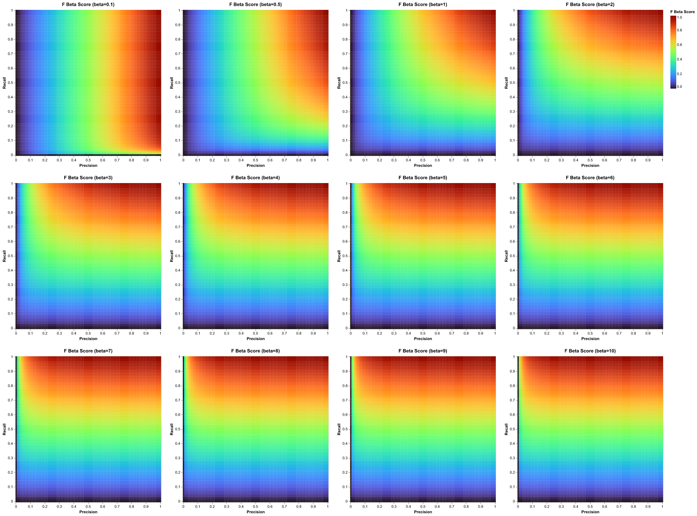

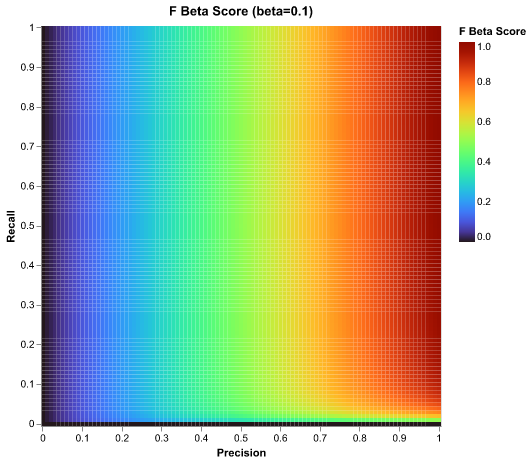

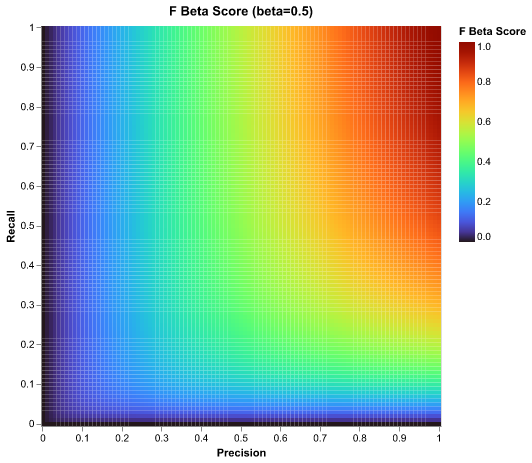

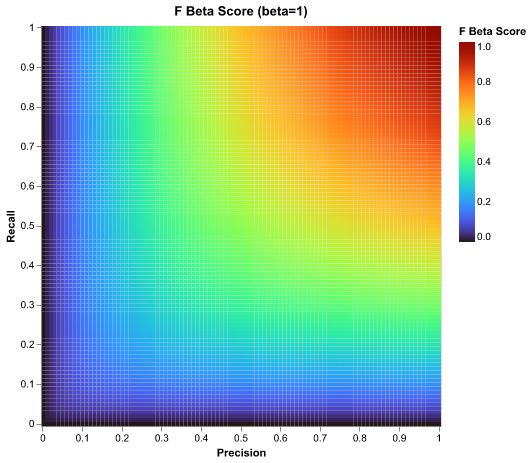

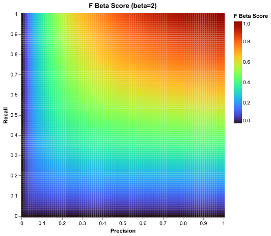

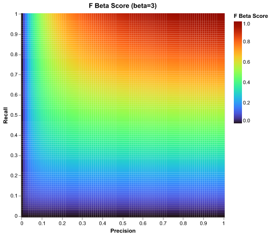

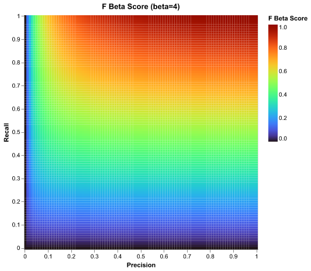

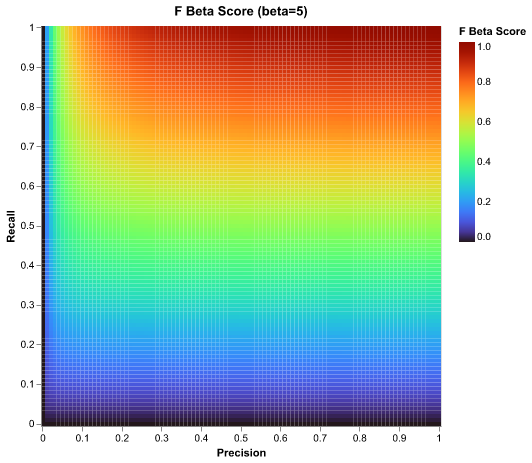

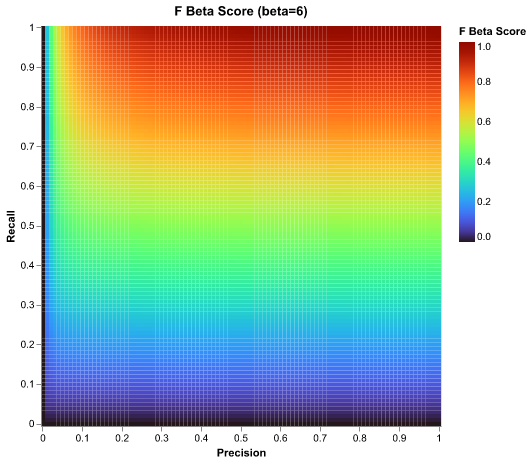

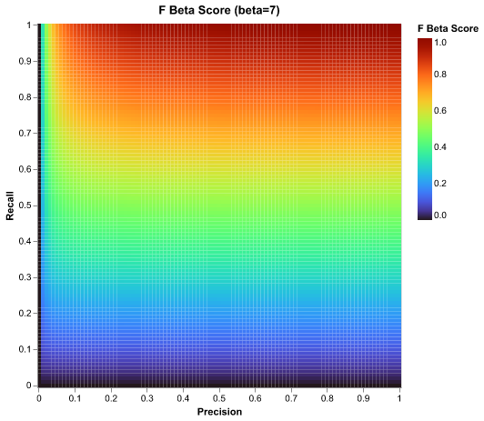

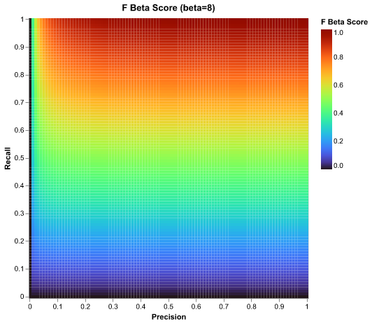


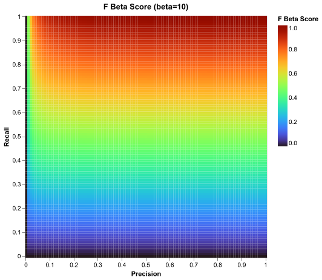


## コード
```python
"""
f beta score の beta を変化させたときの f beta score の値の変化を可視化するコード
"""

import altair as alt
import pandas as pd
import numpy as np


def calc_fbeta_score(precision: float, recall: float, beta: float) -> float:
    if precision == 0 or recall == 0:
        return 0.0
    return (1 + beta ** 2) * (precision * recall) / (beta ** 2 * precision + recall)

def create_heatmap(data: pd.DataFrame, title: str) -> alt.Chart:

    x_min, x_max = data["precision"].min(), data["precision"].max()
    y_min, y_max = data["recall"].min(), data["recall"].max()
    x_tick_values = np.linspace(x_min, x_max, 11).round(2).tolist()
    y_tick_values = np.linspace(y_min, y_max, 11).round(2).tolist()

    chart = (
        alt.Chart(data)
        .mark_rect()
        .encode(
            x=alt.X(
                "precision:O",
                title="Precision",
                sort="ascending",
                axis=alt.Axis(values=x_tick_values, labelAngle=0),
            ),
            y=alt.Y(
                "recall:O", title="Recall", sort="descending", axis=alt.Axis(values=y_tick_values)
            ),
            color=alt.Color(
                "fbetascore:Q", title="F Beta Score", scale=alt.Scale(scheme="turbo")
            ),
            tooltip=["precision:Q", "recall:Q", alt.Tooltip("fbetascore:Q", format=".3f")],
        )
        .properties(title=title, width=400, height=400)
    )
    return chart


def main():
    # x, y を 0.1 刻みで 0 から 1 までの範囲で生成
    x_values = np.arange(0, 101, 1) / 100
    y_values = np.arange(0, 101, 1) / 100

    # f beta score のデータ, 1 刻みで beta を 1 から 10 まで変化させる
    # また、0.1, 0.5 も追加する
    fbeta_data: list[dict[str, float]] = []
    for beta in [0.1, 0.5] + list(range(1, 11)):
        for precision in x_values:
            for recall in y_values:
                fbeta_data.append(
                    {"precision": precision, "recall": recall, "fbetascore": calc_fbeta_score(precision, recall, beta), "beta": beta}
                )

    # DataFrameに変換
    fbeta_df = pd.DataFrame(fbeta_data)

    # 3行 4 列で並べる
    charts = []
    for beta in [0.1, 0.5] + list(range(1, 11)):
        chart = create_heatmap(fbeta_df[fbeta_df["beta"] == beta], f"F Beta Score (beta={beta})")
        charts.append(chart)
    rows = [alt.hconcat(*charts[i:i+4]) for i in range(0, len(charts), 4)]
    combined_chart = alt.vconcat(*rows).resolve_scale(color="shared")

    combined_chart.save("fbeta_heatmaps.png")
    print("グラフを fbeta_heatmaps.png に保存しました")

    for beta in [0.1, 0.5] + list(range(1, 11)):
        create_heatmap(fbeta_df[fbeta_df["beta"] == beta], f"F Beta Score (beta={beta})").save(f"fbeta_heatmap_beta_{beta}.png")


if __name__ == "__main__":
    main()
```