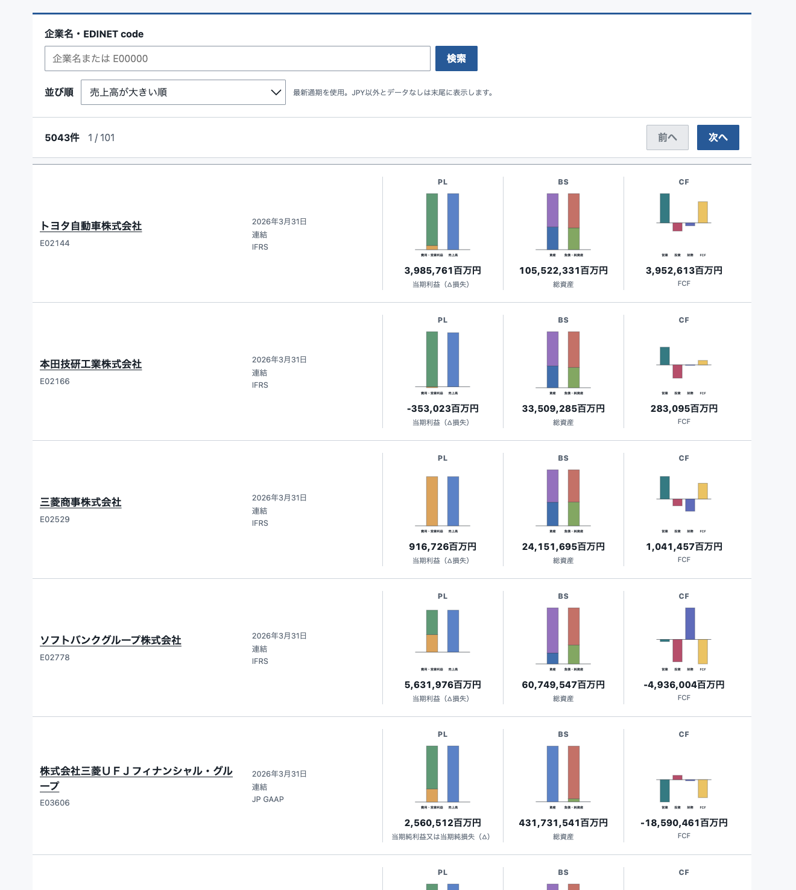
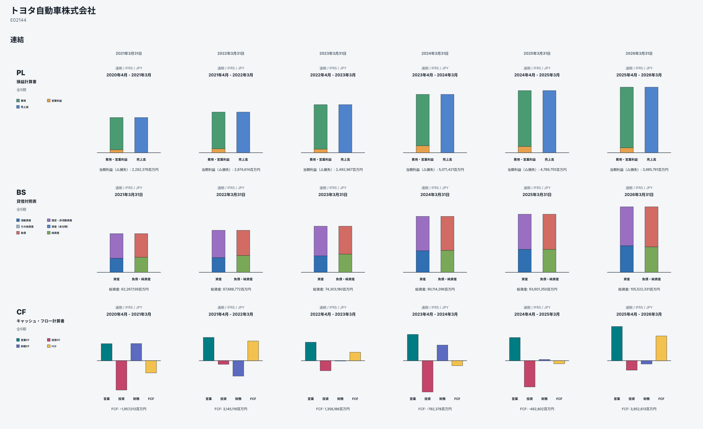

## 作成したサイト 
作成したのは以下のサイトです。

- [財務諸表 Viewer](https://financial-statements-viewer.sasakiy84.net/)

EDINET の API を利用して取得した XBRL ファイルを用いて、損益計算書、貸借対照表、キャッシュフロー計算書を可視化して閲覧できるWebサイトを作成しました。

たとえば、上の画像はトヨタ自動車株式会社の5年間分の通期の連結財務諸表を可視化したものです。
なかなか一覧性があっていいのではないでしょうか。
非連結の財務諸表の閲覧や、過去10年分、四半期の財務諸表の閲覧も可能です。

## コンセプト
LLM に聞けばいくらでも詳細な企業分析をやってくれる時代です。
そのような時代において必要なものは、
人間が概要をざっと把握し、企業についての温度感をつかむことができるようなサービスだと考えました。

企業の概要を大掴みに把握し、
詳細な分析を聞いたときに問いをもてるような、
あるいは詳細な分析をするための前段階で使える媒体として、
ビジュアライゼーションが有効です。
おおまかな理解において、
人間の目は細かい数値の読み取りよりも、
面積の大小や色の違いの方が理解しやすいです。

以上のように、LLM 時代に便利な（必要な）サービスはなんだろう、という問いに対する答えの一つが可視化サービスです。

## 技術面
ウェブサイトの内容としては簡単な会計知識があれば理解できる内容ですので、
主に技術面について簡潔に説明します。

XBRL は [Python の arelle](https://pypi.org/project/arelle-release/)を利用してパースして JSON にしました。
パースについては、以下の記事のコードを流用しました。

- [上場企業の過去10年分の財務諸表データを CSV 形式でダウンロードできる Jupyter Notebook の公開 | sasakiy84.net](https://blog.sasakiy84.net/articles/20251224-edinet-csv-notebook/)
- [XBRL の計算リンクを用いた財務諸表データの収集 | sasakiy84.net](https://blog.sasakiy84.net/articles/20251014-xbrl-cal-link/)

パースして得た JSON データをフロントエンドに渡して、jinja2 で HTML をつくっています。
画像は OGP として使うものだけを事前に生成し、それ以外はブラウザ側で描画しています。

デプロイには Cloudflare Pages を使っています。
GitHub Pages には総容量の関係でデプロイできなかったのですが、
Cloudflare Pages にはこれくらいのサイズであれば無料でデプロイできました。えらい。

なお、最初は全ての SVG を事前に生成しておこうとしたのですが、それはさすがに無理でした。
また、ビルドパイプラインを AWS などのクラウドに載せて、日次のバッチ処理で最新のデータに追従するような構成も検討していますが、
まだそこまではやっていません。

