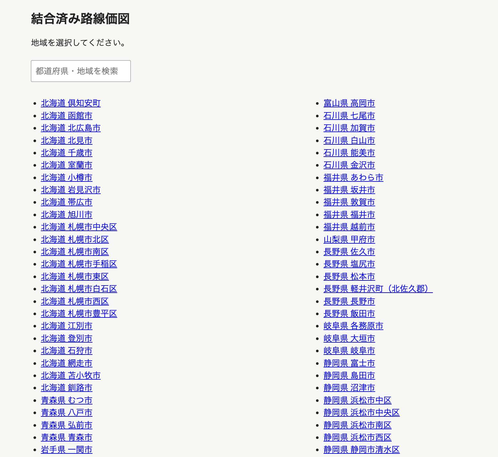
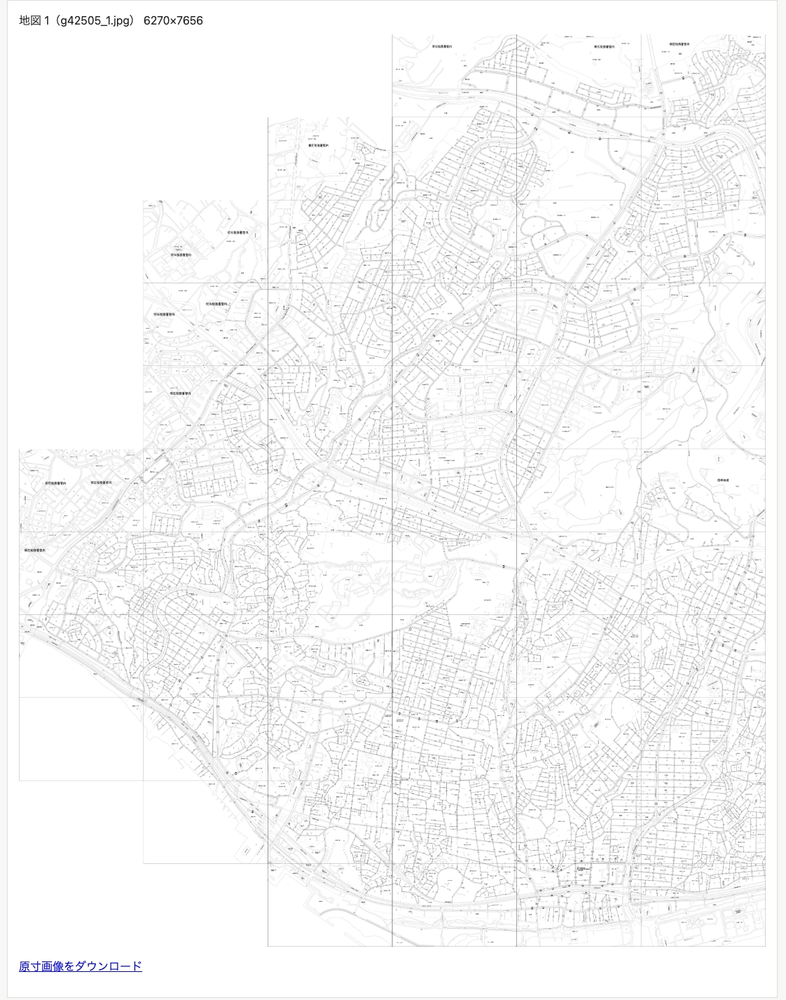

## 作成したサイト
作成したのは以下のサイトです。

- [結合済み路線価図](https://rosenka-mosaic.sasakiy84.net/)

路線価図は国税庁のサイトで公開されており、無料で閲覧できます。
おおまかに市町村ごとに分割されているのですが、
市町村の中でさらに小さい画像に分割されており、1枚の大きな画像として閲覧することはできません。

しかし、[『路線価図でまち歩き　土地の値段から地域を読みとく』](https://book.gakugei-pub.co.jp/gakugei-book/9784761528515/)のようなことをやろうとすると、1枚の大きな画像として閲覧できる方が便利です。
そのため、路線価図の画像を結合して、1枚の大きな画像としてダウンロードできるサイトを作成しました。

ちなみに、上記の書籍を読んだことが今回のサイトを作成するきっかけです。
路線価図を見ながらの街歩き、してみたいですね。

## 技術
国税庁のサイトから路線価図の画像と位置関係を取得して保存します。
そして、画像の特徴量をもとに余白や凡例の除去などをしたうえで、
元サイトで公開されている位置関係をもとに、画像を結合して1枚の大きな画像を作成します。

そして、それらを表示するだけの HTML を作成したうえで、画像は Cloudflare R2 にアップロードして、
画像のリンクを含んだ HTML を Cloudflare Pages でデプロイしました。
画像のサイズが大きいので、さすがに Cloudflare Pages の無料枠単体ではデプロイできなかったのですが、
R2 のコストは現在の容量であれば年間18ドル程度（100GBくらい）で、インターネットへの転送料も無料なので、
まあ許容範囲かな、という感じです。

現在は自動更新はしておらず、
どこまで積極的に更新するかも未定ですが、
思い出したて暇なときに更新用スクリプトを実行しようかな、と考えています。

