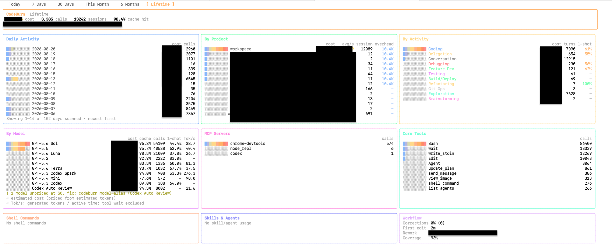

## モチベーション
Agent をぶん回すために、プロジェクトごとのコンテナを立ち上げて使うことが多い。
この方法は Agent にフルアクセスを与えることができる一方で、ログがコンテナごとに散らばってしまって、あとでまとめて分析するのが面倒になるという問題がある。
Codex にも Claude にも OTEL のようなログ収集の仕組みはあるのだけど、
コンテナを立ち上げるたびに設定することを忘れそうだし、
過去のログがあるのでそれを一旦集約したいという気持ちもある。

というわけで、コマンド一発で過去のログを集約できる仕組みが欲しくなった。
自作のログ収集ツールをつくるほどでもないので、nginx の WebDAV 機能を使って書き込み専用のアップロードサーバーを立てることにした。
WebDAV の読み取りメソッドを制限することで、リスクを最小限にできる。

これによって集めたログに、サードパーティの適当なコマンドを使うことで、以下のような情報が得られる。




あるいは、こんな表が作れたりする（トークンの使用量のところは適当に実際の値からは変えている）。

```
$ CODEX_HOME="/srv/webdav/codex/sessions/" bunx ccusage codex monthly

╭────────────────────────────────────────────╮
│                                            │
│     Codex Token Usage Report - Monthly     │
│                                            │
╰────────────────────────────────────────────╯

┌──────────┬───────────────────────┬──────────────┬─────────────┬─────────────┬─────────────────┬─────────────────┬─────────────┐
│ Month    │ Models                │        Input │      Output │   Reasoning │      Cache Read │    Total Tokens │  Cost (USD) │
├──────────┼───────────────────────┼──────────────┼─────────────┼─────────────┼─────────────────┼─────────────────┼─────────────┤
│ 2025-11  │ - gpt-5-codex         │      643,508 │      81,050 │      49,984 │       7,523,968 │       8,248,526 │       $2.56 │
│          │ - gpt-5.1-codex       │              │             │             │                 │                 │             │
├──────────┼───────────────────────┼──────────────┼─────────────┼─────────────┼─────────────────┼─────────────────┼─────────────┤
│ 2026-01  │ - gpt-5.2-codex       │       92,672 │      17,512 │       5,504 │       1,574,272 │       1,684,456 │       $0.68 │
├──────────┼───────────────────────┼──────────────┼─────────────┼─────────────┼─────────────────┼─────────────────┼─────────────┤
│ 2026-02  │ - gpt-5.2             │   12,460,017 │     686,785 │     222,810 │     157,706,240 │     170,853,042 │      $59.02 │
│          │ - gpt-5.2-codex       │              │             │             │                 │                 │             │
│          │ - gpt-5.3-codex       │              │             │             │                 │                 │             │
├──────────┼───────────────────────┼──────────────┼─────────────┼─────────────┼─────────────────┼─────────────────┼─────────────┤
│ 2026-03  │ - gpt-5.3-codex       │      791,051 │      41,950 │       9,956 │       4,139,904 │       4,972,905 │       $2.70 │
├──────────┼───────────────────────┼──────────────┼─────────────┼─────────────┼─────────────────┼─────────────────┼─────────────┤
│ 2026-05  │ - gpt-5.4             │   16,332,056 │   1,227,885 │     288,882 │     294,386,432 │     311,946,373 │     $263.56 │
│          │ - gpt-5.5             │              │             │             │                 │                 │             │
├──────────┼───────────────────────┼──────────────┼─────────────┼─────────────┼─────────────────┼─────────────────┼─────────────┤
│ 2026-06  │ - gpt-5.3-codex-spark │  141,796,523 │   8,865,853 │   1,773,206 │   2,835,863,552 │   2,986,525,928 │    $2360.01 │
│          │ - gpt-5.5             │              │             │             │                 │                 │             │
├──────────┼───────────────────────┼──────────────┼─────────────┼─────────────┼─────────────────┼─────────────────┼─────────────┤
│ 2026-07  │ - gpt-5.4             │  159,013,816 │  15,266,266 │   6,614,517 │   3,225,262,336 │   3,399,542,418 │    $2691.07 │
│          │ - gpt-5.4-mini        │              │             │             │                 │                 │             │
│          │ - gpt-5.5             │              │             │             │                 │                 │             │
│          │ - gpt-5.6-luna        │              │             │             │                 │                 │             │
│          │ - gpt-5.6-sol         │              │             │             │                 │                 │             │
│          │ - gpt-5.6-terra       │              │             │             │                 │                 │             │
├──────────┼───────────────────────┼──────────────┼─────────────┼─────────────┼─────────────────┼─────────────────┼─────────────┤
│ 2026-08  │ - gpt-5.5             │  176,271,744 │  13,599,027 │   4,946,125 │   6,642,525,056 │   6,832,395,827 │    $3661.46 │
│          │ - gpt-5.6-luna        │              │             │             │                 │                 │             │
│          │ - gpt-5.6-sol         │              │             │             │                 │                 │             │
│          │ - gpt-5.6-terra       │              │             │             │                 │                 │             │
├──────────┼───────────────────────┼──────────────┼─────────────┼─────────────┼─────────────────┼─────────────────┼─────────────┤
│ Total    │                       │  507,401,387 │  39,786,328 │  13,910,984 │  13,168,981,760 │  13,716,169,475 │    $9041.06 │
└──────────┴───────────────────────┴──────────────┴─────────────┴─────────────┴─────────────────┴─────────────────┴─────────────┘
```


## nginx で書き込み専用の WebDAV アップロードサーバーを構築する

Codex のセッションログなど、外部プロセスからファイルをアップロードするだけの受け口が欲しくなった。nginx の `dav` モジュールを使えば、認証付きの書き込み専用 WebDAV エンドポイントを簡単に用意できる。ここでは `agent-log-uploader-web-dav.example.com` を例に手順をまとめる。

なお、`PROPFIND` という list 系のメソッドを許可しているため、ディレクトリ構造やファイル名は外部から見えてしまう。もしそれが嫌な場合は、`PROPFIND` を許可せずに `PUT` と `MKCOL` のみを許可することもできるが、毎回全てをアップロードすることを許容し、アップロード側のコマンドを工夫しなければいけない。

### 前提

- nginx がインストール済み
- 対象ドメインの証明書を Certbot などで設定済み
- 以下では codex を想定しているが、少し書き換えれば claude などのログ収集にも使える

### 1. dav モジュールの確認

Ubuntu 標準の nginx パッケージには `ngx_http_dav_module` が含まれていないことが多い。`nginx -V` で確認する。

```bash
nginx -V 2>&1 | grep -o with-http_dav_module
```

確認できたら、以下で WebDAV の拡張メソッドをサポートするモジュールをインストールする。

```bash
sudo apt update
sudo apt install -y libnginx-mod-http-dav-ext
```

このモジュールは、WebDAV の拡張メソッド（`PROPFIND` など）をサポートするために必要である。

### 2. アップロード先ディレクトリの作成

```bash
sudo mkdir -p /srv/webdav/codex/sessions
sudo chown -R www-data:www-data /srv/webdav/codex/sessions
```

`dav_access user:rw group:r` を使うので、nginx の実行ユーザー(`www-data`)が書き込めるようにしておく。
なお、codex のセッションログは、`~/.codex/` のディレクトリ構成に合わせておく。
[ccusage](https://github.com/ccusage/ccusage)などのようにいい感じにディレクトリを走査してくれるツールもあるが、
[codeburn](https://github.com/getagentseal/codeburn)のように `${CODEX_HOME}/sessions/` のディレクトリになっていないと分析できないツールもあるため。

### 3. Basic 認証用ユーザーの作成

```bash
sudo apt install -y apache2-utils
sudo htpasswd -c /etc/nginx/.htpasswd-agent-log agent-uploader
```

### 4. nginx の設定

`/etc/nginx/sites-available/agent-log-uploader-web-dav.example.com` に以下を記述。

```nginx
server {
    server_name agent-log-uploader-web-dav.example.com;

    listen 443 ssl; # managed by Certbot
    ssl_certificate /etc/letsencrypt/live/agent-log-uploader-web-dav.example.com/fullchain.pem; # managed by Certbot
    ssl_certificate_key /etc/letsencrypt/live/agent-log-uploader-web-dav.example.com/privkey.pem; # managed by Certbot
    include /etc/letsencrypt/options-ssl-nginx.conf; # managed by Certbot
    ssl_dhparam /etc/letsencrypt/ssl-dhparams.pem; # managed by Certbot

    location / {
        root /srv/webdav/;

        client_max_body_size 0;
        client_body_timeout 300s;
        create_full_put_path on;
        dav_access user:rw group:r;

        dav_methods PUT MKCOL;
        dav_ext_methods PROPFIND OPTIONS;

        auth_basic "Agent sessions (write-only)";
        auth_basic_user_file /etc/nginx/.htpasswd-agent-log;

        limit_except PUT MKCOL PROPFIND OPTIONS {
            deny all;
        }
    }
}
```

ポイントは以下の通り。

- `dav_methods PUT MKCOL` : ファイル作成・ディレクトリ作成のみ許可
- `dav_ext_methods PROPFIND OPTIONS` : WebDAV クライアントの疎通確認に必要
- `limit_except` で許可メソッド以外(`GET` を含む)を全拒否して外部からの閲覧・ダウンロードを防ぐ
- `client_max_body_size 0` : アップロードサイズ制限を無効化

有効化して構文チェック後、リロードする。

```bash
sudo ln -s /etc/nginx/sites-available/agent-log-uploader-web-dav.example.com /etc/nginx/sites-enabled/
sudo nginx -t
sudo systemctl reload nginx
```

### 5. 動作確認

rclone で使うときは、以下のコマンドを実行する。
これは、Debian/Ubuntu 系の Linux で、rclone がインストールされていない場合は自動でインストールし、パスワードを聞いてきて obscured してアップロードする例である。

```bash
command -v rclone &>/dev/null || (sudo apt update && sudo apt install -y rclone); printf "Password: "; read -s RCLONE_PW; printf "\n" && rclone copy ~/.codex/sessions :webdav: --webdav-url https://agent-log-uploader-web-dav.example.com/codex/sessions/ --webdav-vendor other --webdav-user agent-uploader --webdav-pass "$(rclone obscure "$RCLONE_PW")" -P; unset RCLONE_PW
```

これで、`~/.codex/sessions/` 以下のファイルがすべて WebDAV サーバーの `/srv/webdav/codex/sessions/` にアップロードされる。

たとえば、冒頭の集計結果は、以下のようなコマンドで得られる。

```bash
$ CODEX_HOME="/srv/webdav/codex" bunx codeburn report -p all --provider codex
$ CODEX_HOME="/srv/webdav/codex/sessions/" bunx ccusage codex monthly
```

## まとめ
非常に簡易的だが、Agent のログを集約する仕組みを構築できた。
個人用途にしか使えないレベルのものだが、ログを集約するだけなら十分である。

一番最初に示したような画像のようなものが表示できるのだが、
TOOL の使い方とか SKILL の使い方を分析するには情報量が足りない。
最終的にきちんと分析しようと思ったら、`~/.codex/sessions/` のログだけでなく、OTEL まわりや Hooks を使っていく必要がある。
